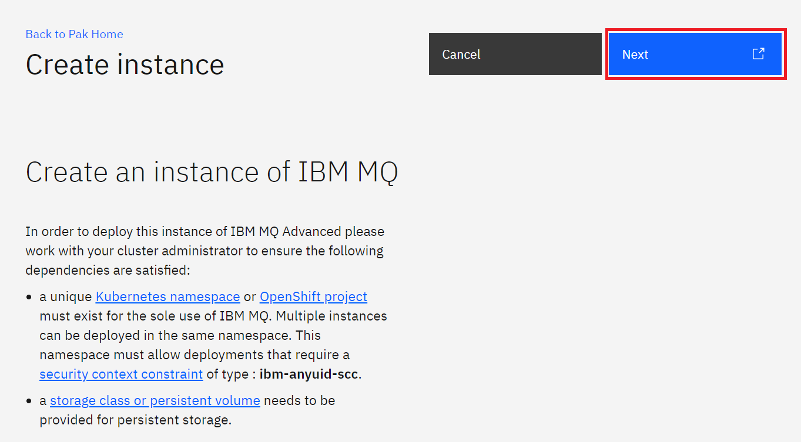

# Building an MQ Build in OpenShift with LDAP automatically configured
This lab will guide you through how to create a MQ container layer into the provided CP4I MQ Certified Container. 
This layer will include configuration for LDAP and we will use the MQ samples to verify the setup.

## Pre-requisites
1. An LDAP server is required for this LDAP and I've created another GitHub repository for the setup of the LDAP environment. 
This uses OpenLDAP and is almost completely automated, please consult [here](https://github.ibm.com/CALLUMJ/OpenLDAP) for details.
1. You have installed the OpenShift command line and logged into the target OpenShift environment. If you are unaware of how to do this please consult [here](https://docs.openshift.com/container-platform/4.2/cli_reference/openshift_cli/getting-started-cli.html)
1. You have already created a namespace within OpenShift called *mq* and configured for a MQ deployment

## Instructions
These instructions will be seperated into three sections:
1. Building the MQ pipeline that generates a LDAP enabled MQ image
   * To avoid un-needed typos this will be mainly completed using the command line.
1. Deploying the LDAP enabled MQ using the CP4I console
1. Testing the solution

### Building the MQ pipeline that generates a LDAP enabled MQ image
All the configuration required can be found [here](https://github.ibm.com/CALLUMJ/MQonCP4I/tree/master/resources/kubernetes/buildldapmq) download locally.
1. To install simply download the repository.     
2. Change directory to <github download>/MQonCP4I/resources/kubernetes/buildldapmq
2. Log into OpenShift using the [command line](https://docs.openshift.com/container-platform/4.2/cli_reference/openshift_cli/getting-started-cli.html)
2. An image stream and its associated tags provide an abstraction for referencing container images from within OpenShift Container Platform.
The image stream and its tags allow you to see what images are available and ensure that you are using the specific image you need even if the 
image in the repository changes. Therefore the first stage is to create a image stream, this is provided within *createimagestream.yaml*:      
   ```
   apiVersion: image.openshift.io/v1
   kind: ImageStream
   metadata:
   name: mqldap
   namespace: mq
   ```    
   Create the new image stream by running the following command:      
   ```
   oc create -f createimagestream.yaml -n mq
   ```
2. The build will need to access the IBM entitled registry to retreive the shipped CP4I MQ image. Therefore you need to import a
secret to provide this access. The process is documented in the [following](https://github.ibm.com/UnifiedKubeMarketplace/KubeMarketplace/issues/45).
For reference my entitlement key secret took the following format:
   ```
   kind: Secret
   apiVersion: v1
   metadata:
     name: entitled-registry
     namespace: mq
   data:
     .dockerconfigjson: >-
    <CONTENT>
   type: kubernetes.io/dockerconfigjson
   ```
   The most important aspect is that the secret is created in the correct namespace (in this case *mq*) and is called *entitled-registry*.      

2. To create a new container image that includes the MQ LDAP configuration we will use the OpenShift BuildConfig. 
This adds in a MQSC into the container image that will be automatically loaded on startup. 
This is a relatively straightforward piece of configuration:       
   ```
   DEFINE QLOCAL('Q1')
   DEFINE CHANNEL(QMLDAP_SVRCONN) CHLTYPE(SVRCONN) TRPTYPE(TCP) SSLCIPH(ECDHE_RSA_AES_128_CBC_SHA256) SSLCAUTH(OPTIONAL)
   SET CHLAUTH(QMLDAP_SVRCONN) TYPE(BLOCKUSER) ACTION(REPLACE) USERLIST('nobody')
   DEFINE AUTHINFO(USE.LDAP) AUTHTYPE(IDPWLDAP) CONNAME('ldap-service.ldap(389)') LDAPUSER('cn=admin,dc=ibm,dc=com') LDAPPWD('admin') SECCOMM(NO) USRFIELD('uid') SHORTUSR('uid') BASEDNU('ou=people,dc=ibm,dc=com') AUTHORMD(SEARCHGRP) BASEDNG('ou=groups,dc=ibm,dc=com') GRPFIELD('cn') CLASSGRP('groupOfUniqueNames') FINDGRP('uniqueMember')
   ALTER QMGR CONNAUTH(USE.LDAP)
   REFRESH SECURITY
   SET AUTHREC OBJTYPE(QMGR) GROUP('apps') AUTHADD(ALL)
   SET AUTHREC PROFILE('Q1') OBJTYPE(QUEUE) GROUP('apps') AUTHADD(ALL)
   REFRESH SECURITY
   ```
   The build configuration can be found in *buildconfig.yaml*:     
   ```
   apiVersion: build.openshift.io/v1
   kind: BuildConfig
   metadata:
     name: mqldap
     namespace: mq
     labels:
       name: docker-build
   spec:
     source:
       dockerfile: |-
         FROM cp.icr.io/cp/icp4i/mq/ibm-mqadvanced-server-integration:9.1.3.0-r4-amd64
         RUN echo $'DEFINE QLOCAL(Q1) \n\
         DEFINE CHANNEL(QMLDAP_SVRCONN) CHLTYPE(SVRCONN) TRPTYPE(TCP) SSLCIPH("ECDHE_RSA_AES_128_CBC_SHA256") SSLCAUTH(OPTIONAL)  \n\
         SET CHLAUTH(QMLDAP_SVRCONN) TYPE(BLOCKUSER) ACTION(REPLACE) USERLIST("nobody") \n\
         DEFINE AUTHINFO(USE.LDAP) AUTHTYPE(IDPWLDAP) CONNAME("ldap-service.ldap(389)") LDAPUSER("cn=admin,dc=ibm,dc=com") LDAPPWD("admin") SECCOMM(NO)       USRFIELD("uid") SHORTUSR("uid") BASEDNU("ou=people,dc=ibm,dc=com") AUTHORMD(SEARCHGRP) BASEDNG("ou=groups,dc=ibm,dc=com") GRPFIELD("cn") CLASSGRP("groupOfUniqueNames") FINDGRP("uniqueMember")\n\
         ALTER QMGR CONNAUTH(USE.LDAP)\n\
         REFRESH SECURITY\n\
         SET AUTHREC OBJTYPE(QMGR) GROUP("apps") AUTHADD(ALL)\n\
         SET AUTHREC PROFILE("Q1") OBJTYPE(QUEUE) GROUP("apps") AUTHADD(ALL)\n\
         REFRESH SECURITY' > /etc/mqm/ldap.mqsc
         RUN cat /etc/mqm/ldap.mqsc
     strategy:
       type: Docker
       dockerStrategy:
         from:
           kind: "DockerImage"
           name: "cp.icr.io/cp/icp4i/mq/ibm-mqadvanced-server-integration:9.1.3.0-r4-amd64"
         pullSecret:
           name: entitled-registry
     output:
       to:
         kind: ImageStreamTag
         name: 'mqldap:latest-amd64'
   ```    
   Create the new build configuration by running the following command:      
   ```
   oc create -f buildconfig.yaml -n mq
   ```
2. Although the above step creates the build configuration, it does not start a build automatically. To do this run the following command:      
   ```
   oc start-build mqldap -n mq
   ```      
2. Prior to deploying the helm chart we need to install TLS certificates that can be used for the Queue Manager. 
To simplify this process these have already been created and can be found in mqcert.yaml:      
   ```
   kind: Secret
   apiVersion: v1
   metadata:
     name: mqcert
     namespace: mq
   data:
     tls.crt: >-
       LS0tLS1CRUdJTiBDRVJUSUZJQ0FURS0tLS0tCk1JSURDVENDQWZHZ0F3SUJBZ0lVR0tiaE5ZWXJMZVdqUFBVTlp5RldJTjJQWExRd0RRWUpLb1pJaHZjTkFRRUwKQlFBd0ZERVNNQkFHQTFVRUF3d0piRzlqWVd4b2IzTjBNQjRYRFRJd01ERXdOakV3TURjeU4xb1hEVE13TURFdwpNekV3TURjeU4xb3dGREVTTUJBR0ExVUVBd3dKYkc5allXeG9iM04wTUlJQklqQU5CZ2txaGtpRzl3MEJBUUVGCkFBT0NBUThBTUlJQkNnS0NBUUVBem5EbkpGaHhFMGRMTFdhOUZZQlBvakZNdWVSL1pESXJZTEE0OGFWYVNNYU8KRjhNT0o0RGpHQWJ1L0UwbjlIR3JxSXI5bnRSc29SZkhjMFdhcExDcFdwdXdnWlBFSXVXR25MS2xjdVJtYnRVVApUUlkvQkhITEtrVUFncnlCUXVqZFh2RFRobnltYXZCUGpLM1QxZlZFMGNFT1lHQTlHanJYU0IzT2hQR1pHQmxOCmM5NXppZEZSOVZyWHQwRFJDVkFrNjRmYlRoa3V2SDh1TkV1VGFodlVFOVJIZmRzajJzZU81S0k3bmdYMG1IUUIKcUlMdVAzcGEreU1WNUc4TlBaalN4U0IwQjNlS3YraUNjV2hSdTZSRmIyZmNmZXpnbm1TcFJYVTUwS1lxV1piZApvc0czaFFxU1JRUTJZUmR5NzZaMGJKb3FGM3N0aGJJaTZ5TmYvTVQ5ZndJREFRQUJvMU13VVRBZEJnTlZIUTRFCkZnUVVIQlBGY0FyTy9ZUmxiZ0tobmkxSVdnS0Z5VEF3SHdZRFZSMGpCQmd3Rm9BVUhCUEZjQXJPL1lSbGJnS2gKbmkxSVdnS0Z5VEF3RHdZRFZSMFRBUUgvQkFVd0F3RUIvekFOQmdrcWhraUc5dzBCQVFzRkFBT0NBUUVBWkZ6SQpaLzZOay9TQmY0WXJHdVdNSzVjTTRLdldjWUdXQWlndTZ1TzZvV2VUVmdYamtGbE9GZ2RHRVhpSjFZNi9mRFBCCitaMVE0SERMYm1hbGE1aXRqeVhXbWFsRTFFOHR2bThGMDA5ZEFPL0oxUmNyS1VZcUFKbGJQNTZtbmt1QmtqZE0KYzAyMkhXOTd0RUpkYXViTlF2ZWJraDhZK1loUGVkV242ZmFtMVM1S2cwYUlVUWRKd0FuZDlCb2hLVkk3SHFFZgpoUktDYmJFZzNySXlSS0FLdk5DRXlvMjY4b3VIcll3Mi9WMEhMU0VnWEU3UTFxWTVKaXF6Y3Iyb0EvU2xZdGZwCnZYZFhKajA3OGJ1N3hrS2FxZkxpN3FTSzdjSVRjWjNWcldGOWZCbEh5MVV1K2V1NVNhN29udFR2MktON2Joc1QKNGczVTlMdWR2L01xTE5EWDVnPT0KLS0tLS1FTkQgQ0VSVElGSUNBVEUtLS0tLQo=
     tls.key: >-
       LS0tLS1CRUdJTiBQUklWQVRFIEtFWS0tLS0tCk1JSUV2UUlCQURBTkJna3Foa2lHOXcwQkFRRUZBQVNDQktjd2dnU2pBZ0VBQW9JQkFRRE9jT2NrV0hFVFIwc3QKWnIwVmdFK2lNVXk1NUg5a01pdGdzRGp4cFZwSXhvNFh3dzRuZ09NWUJ1NzhUU2YwY2F1b2l2MmUxR3loRjhkegpSWnFrc0tsYW03Q0JrOFFpNVlhY3NxVnk1R1p1MVJOTkZqOEVjY3NxUlFDQ3ZJRkM2TjFlOE5PR2ZLWnE4RStNCnJkUFY5VVRSd1E1Z1lEMGFPdGRJSGM2RThaa1lHVTF6M25PSjBWSDFXdGUzUU5FSlVDVHJoOXRPR1M2OGZ5NDAKUzVOcUc5UVQxRWQ5MnlQYXg0N2tvanVlQmZTWWRBR29ndTQvZWxyN0l4WGtidzA5bU5MRklIUUhkNHEvNklKeAphRkc3cEVWdlo5eDk3T0NlWktsRmRUblFwaXBabHQyaXdiZUZDcEpGQkRaaEYzTHZwblJzbWlvWGV5MkZzaUxyCkkxLzh4UDEvQWdNQkFBRUNnZ0VBQ0czcndqd3FRZE5EYXBNclhWbGo1d2VFVG9MYUFNbGJwQk1PQUMvMFE4eDMKdU5pcUYwclgrdjh0ZXZmYmpjdW1hcmRpSzc0WXdXc3JKYlhOM3JPbjlwOHMwZDJxd0pJR3NSZEtVaXFwVkJVMwpPSXFVQUNaMVdVQ0FDTmFSb0ozSmpEcmhLRGltd3U4VkVIVjRsTi95ODIyaW5LVFJXZVRWTFlpcUNodWpXS3g5CkNvUU9qeFpkZFFxV0xNbEtndFRQOGUxSTI2MmNUbVhzVzhhSWQ4dDVpWUZmcFc2OHpLTzZqSmRVWktpdnE2MkcKc3hqYnF5Kzk1SitqbzBLeWUybzN0M2NFempJUEk4L1hhRmllTlFFTUZtRWVlVzVSNE1iZ3VNblpocTBVV1BzSwpWdHE0Ukp2OW02aC9RWGlqMGVCY281Rnp2MFB5RHZtUFkrZWUwT1plQVFLQmdRRHBQUm9wanpMYjhFRnUzcnU2Cktyc1BNYzUvbUc4S1pmY0NGejdjSHRQdTJEQzZxTytpRXhkVk5xZ2h6ZGtLK05kalFGUGNmdlRQZXhCOWhsWUEKN0NtOE1QRkxSNUhNditFL3BSQm5UNzVLZHdhT2NjT21ibFNGSE1LSjhJVXZld3daaERhQWFFWlNmQld0TU9GdwpKa0FrTDdMTWxkL0Ixbk9LaDM5YmR1ZEpRUUtCZ1FEaWxsT3ZGVkVjaUxyM28yR1JzUnhIK1lMQkJjbUZpSEo2CngzQ1JNQjRPMldZMjJPYXpsZVJZUXdqdU1PS2xGNmNiR0VBR1JKaVRIbGo2MFE0cXVwbERrbVJTdWVJcnBRMTEKU3A1MnMranY3WXpZdFpxUG00UzFtaG9xcU1iRDg2V2VEZnp6RUIweWJPUk8xZW04NXRqZStoN3FvN0Y5QWUrSwplU29TUDduV3Z3S0JnQUpTQlV5Y2pCajhEdXFYZEs2cGRpcjBoK1ZsRXRXN3BmVnpYY0M2M2NqbWhiV1ZzS3lnCkcvOVJCK011TlJhUzJ6RzFsaC8vYzFnTkZXRHFVVGk1SU1FcWkzd0FQa2NYTVpwOGZlbEpOYzl2MTdUYkZPTTIKL2NoRlBQbzZWbGplbElROGVINVdpenlPMTNoZG9DQ0pnT0hiUjZBWmJaeDBFYm96RnVWR0RZOEJBb0dBUCs1QQpRRWNZY3ArVmVTZU04T2x5M0UvbTk0VWxmZHFveWtHWlhpMmdYWG96WDhoRkYyaDBXLzdWOXphdHkvem5kanFhClhlcGV6aXVpMlduQXdJZVRsTUFxTkRra09rSkFrTlp6N1hRSGhpS1ZPZFBMZnpkVzgxSStqY2kvQkN5cmp2UE4KYWRzakVjWXRpSnpNYlRNSS82aThybUZ2UTZFWE1BL05zZ1p1N2NzQ2dZRUFpN2RWYzhkNmNUUVFKR05HL0l4Vwo2d1dJN1U3V094OTNVTlFEZGVyQUhNeFRBMXRKbHdTRmtNUzYrWXAvZzU0K0tTQWZLTWw4eDVUTnRxM1lpUEdiCkozOGtVU2lxV2VudFYzeExMVmJMRTRUYXgxbkptK0ZFNDV4VWxwYjJyTU5kYjFuOFpOdkVrTTJsRElUMHBKOWUKU3EvWkZXMG1jSGdjVWRpdm93WHJLNVE9Ci0tLS0tRU5EIFBSSVZBVEUgS0VZLS0tLS0K
   type: Opaque
   ```      
   Create the new secret by running the following command:  
   ```
   oc create -f mqcert.yaml -n mq
   ```            

2. Once we have completed the deployment of MQ we will need to create a OpenShift Route to provide access. 
As we are running command line operations we will also complete this now, but logically it would be completed at the end of the next section. 
The build configuration can be found in *route.yaml*:           
   ```
   kind: Route
   apiVersion: route.openshift.io/v1
   metadata:
     name: mq-traffic-mq-ldap-ibm-mq-qm
     namespace: mq
   spec:
     host: qmldap5f-svrconn.chl.mq.ibm.com
     to:
       kind: Service
       name: mq-ldap-ibm-mq
     port:
       targetPort: 1414
     tls:
       termination: passthrough
     wildcardPolicy: None
   ```      
   Create the new route by running the following command:  
   ```
   oc create -f route.yaml -n mq
   ```      
   

### Deploying the LDAP enabled MQ using the CP4I console 
1. Open a web browser and navigate to the CP4I console:  
  
Commonly the first time you attempt to access the CP4I console a warning will appear regarding the certificate. This can be accepted as it is normally due to a self-signed certificate, or a unknow certificate authority. In a real production environment this would commonly be configured with a certificate that would be known by the browser, therefore please accept prior to demonstration to avoid confusion. 
1. Fill in the username / password and select *Log in*. The *Platform home* will be displayed:  

1. This page provides an overview of the capabilities of the Cloud Pak for Integration. We will focus on IBM MQ, so select the IBM MQ icon:  

1. You will be navigated to the IBM MQ section that highlights the capabilities. We want to deploy an IBM MQ instance so select *Create instance*:  

1. The *Create instance* tiles will be shown, select *MQ*:   

1. The launch page for the IBM MQ deployment will be displayed. This highlights any pre-requisites that should be completed prior to deploying. As we are deploying a simple Queue Manager we can skip these, click *Next*:  

1. A new tab will open for the MQ instance configuration, fill in the following fields:
    * *Helm release name*: mq-ldap
    * *Target namespace*: mq
    * *Target cluster*: local-cluster
    * *License*: Accept  
  
1. Expand *All parameters* and scroll down to the *Image* section. Change the *Image repository* value to: *image-registry.openshift-image-registry.svc:5000/mq/mqldap*   
  
1. Scroll down to the *Single sign-on* section. Once deployed the MQ Console will be accessed using the user credentials that you used to access the Integration Console. To assure this works the username used to login *MUST* be specified within the *Web admin users* section. In our case the user is *Admin1*. 
    
1. In the *TLS* section, deselect the *Generate Certificate* and enter any hostname in the *Cluster hostname* field (this is a required field but will not be used as we are generating a new certificate):  
    
1. Scroll down to the PKI section and copy in the following:     
   ```
   - name: default
     secret:
       secretName: mqcert
       items:
         - tls.key
         - tls.crt
   ```    
1. Start the installation by clicking the *Install* button at the bottom right. The install will be started, and you will be presented with:    
  
1. Click *Home*, this will navigate you back to Cloud Pak for Integration console, select the *View instances* tab 

### Testing the solution
1. We will use the MQ sample program called amqsputc to verify the installation.      
1. IBM MQ uses a client channel definition table (CCDT) to configure the connection information. 
This is a JSON format and to accelerate the user a sample has been included below. This is also available [here](https://github.ibm.com/CALLUMJ/MQonCP4I/blob/master/resources/kubernetes/buildldapmq/ccdt.json). 
The only customization required is to change the to your hostname:
   ```
   {
     "channel":
     [
       {
         "general":
         {
           "description": "MQ Non Persistent channel details"
         },
         "name": "QMLDAP_SVRCONN",
         "clientConnection":
         {
           "connection":
           [
             {
               "host": "mq-ldap-ibm-mq-qm-mq.apps.web-mq-5.purple-chesterfield.com",
               "port": 443
             }
           ],
           "queueManager": "mqldap"
         },
         "transmissionSecurity":
         {
           "cipherSpecification": "ECDHE_RSA_AES_128_CBC_SHA256"
         },
	     "type": "clientConnection"
       }
     ]
   }
   ```
   Create this file on your system and complete the customization required.
1. The MQ samples are configured to use the CCDT by specifying the MQCCDTURL environment. Depending on your platform and the location of the file you will need to customize but on our windows setup this was:
   ```
   SET MQCCDTURL=file:///C:/temp/ccdt.json
   ```
1. The sample application also needs access to the TLS certificate that the MQ server will present. If you have used our default certificates specified in this document then you can simply download the [key files from here](https://github.ibm.com/CALLUMJ/MQonCP4I/tree/master/resources/tls).
1. Similar to the CCDT file the TLS certificates are configured using an environment variable:   
   ```
   SET MQSSLKEYR=C:\NonPersistent\key
   ```
1. Finally as we are completing user authentication the username is specified within an environment variable (the password will be inputted when the application starts):       
   ```
   SET MQSAMP_USER_ID=mqapp
   ```
1. Start the sample PUT application by running:   
   ```
   amqsputc Q1 mqldap
   ```
   This should output the following (the password is *mqapp*:
   ```
   C:\Users\CallumJackson>amqsputc Q1 mqldap
   Sample AMQSPUT0 start
   Enter password: *****
   target queue is Q1
   Hello World - LDAP Working

   Sample AMQSPUT0 end
   ```
   If you would like to verify that the message was successfully sent then run the following:      
   ```
   C:\Users\CallumJackson>amqsgetc Q1 mqldap
   Sample AMQSGET0 start
   Enter password: *****
   message <Hello World - LDAP Working>
   no more messages
   Sample AMQSGET0 end
   ```
   Also if you want to verify that LDAP is working and MQ authorization is correctly configured *mqadmin* (password *mqadmin*) has
   also been configured, but without the permissions to access Q1. Have a play and make sure you are comfortable with the environment.
