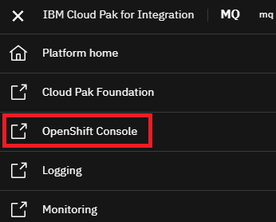

# Connecting MQ Explorer to a deployed Queue Manager in OpenShift
These steps document how you can connect MQ Explorer to a Queue Manager running in OpenShift.

## Pre-requisites
The following instructions assume that you have deployed the Queue Manager using the following instructions:    
[Deploy a persistent Queue Manager in a High Availability mode suitable for demonstration](instructions/multiInstance.md)   
If you have used a different set of instructions then they will need to be customized but the below should be useful in understanding the generic approach.     

## Instructions
The following is seperated into two sections:    
* Finding the information within the OpenShift console
* Configuring the MQ Explorer

### Finding the information within the OpenShift console
1. Navigate to the OpenShift Console by selecting the menu at the top left of the screen and selecting *OpenShift Console*:   
    
1. You will require to log in with the OpenShift credentials which are likely to be different from the Cloud Pak for Integration credentials. If you are unsure please as the OpenShift Administrator for this information. 
1. Navigate to *Networking --> Routes*
1. Assure the *MQ* project is selected:    
    
1. You should see three routes:     
   * mq-demo-ha-ibm-mq-qm: this is not be used - automatically created
   * mq-demo-ha-ibm-mq-web: - this is used to access the web console - automatically created
   * mq-traffic-ha-demo-ibm-mq-qm: - this will be used for communication to the MQ Explorer - you manually created this one      
   *IMPORTANT: Although it appears completely unintuitive copy the hostname from the mq-demo-ha-ibm-mq-web entry as we will need this for the MQ Explore configuration. For example in my case this was: 	mq-demo-ha-ibm-mq-web-mq.apps.web-mq-5.purple-chesterfield.com*

### Configuring the MQ Explorer
1. Open MQ Explorer and right click on Queue Managers and select *Add Remote Queue Manager*.    
1. In the wizard set the Queue Manager Name to *mqdemoha*:     
         
1. Click Next
1. Fill in the following details:      
   * Hostname: this is the hostname you identified in the OpenShift Routes page. In my case this was: *mq-demo-ha-ibm-mq-web-mq.apps.web-mq-5.purple-chesterfield.com*
   * Port number: 443
   * Server-connection channel: MQHADEMO     
   Click Next. 
1. Click Next on the Security Exit details page
1. Click Next on the user identification page
1. You will need to configure a MQ Explorer with the correct security certificates. To simplify this process I've already created the Key Store which is available [here](https://github.ibm.com/CALLUMJ/MQonCP4I/blob/master/resources/tls/MQExplorer.jks). Download this file and reference within the configuration, and check the *Enable SSL key repositories* option.     
        
1. Enter *password* for the TLS Key Store
1. Click Next 
1. Check the *Enable SSL option* and select *ECDHE_RSA_AES_128_CBC_SHA256* from the SSL cipher spec pull down.     
       
1. Click *Finish*
1. The Queue Manager will be added and shown in the navigator:     
       
