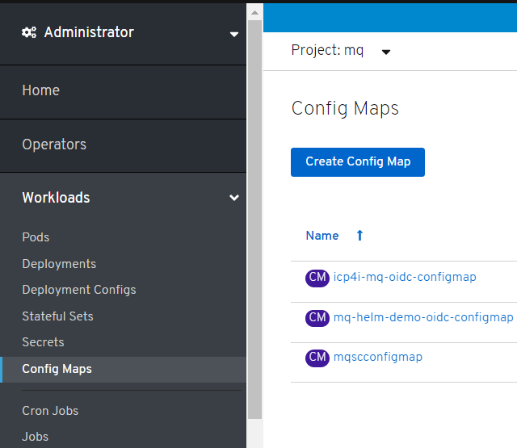
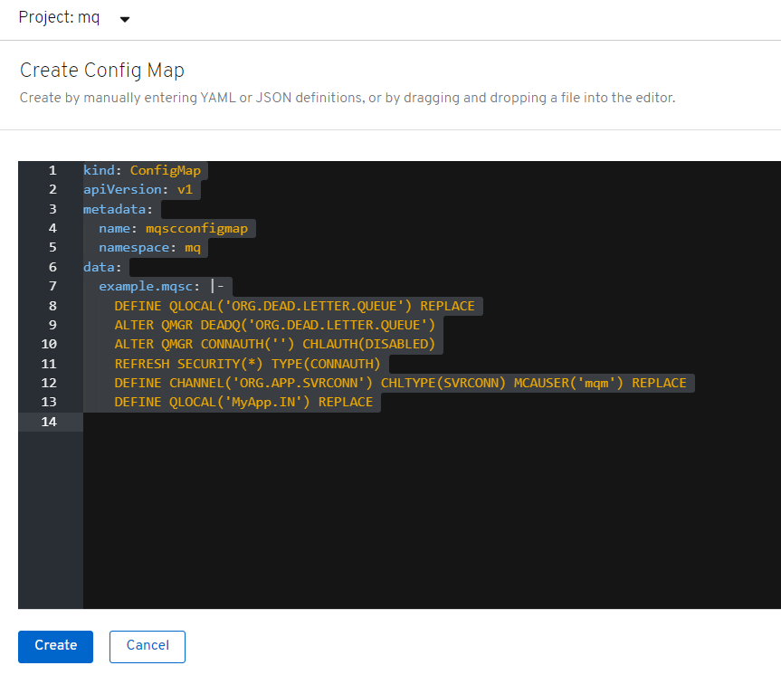
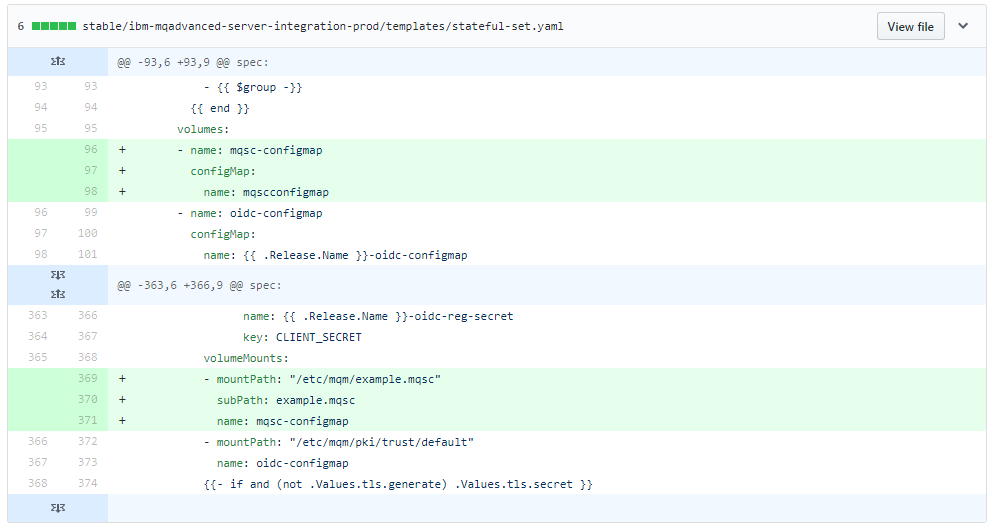

# Loading MQSC configuration using a configMap

Ideally the IBM MQ Advanced Helm chart would allow you to specify a configMap that includes a MQSC file. 
Currently this is not possible however with a simple modification this is possible.      

This approach is not ideal but if clients insist on configMaps instead of a layered container image this is the current approach that avoids having to rebuild the certified container image and losing support.

## Downloading the helm charts
The IBM MQ Advanced helm charts are available [here](https://github.com/IBM/charts/blob/master/repo/entitled) and these instructions were created using [v5.0.0](https://github.com/IBM/charts/blob/master/repo/entitled/ibm-mqadvanced-server-integration-prod-5.0.0.tgz).     

All the changes are within templates/stateful-set.yaml and an example is provided [here](https://github.ibm.com/CALLUMJ/ibm-mqadvanced-server-integration-prod/commit/1aa41bb9c076cae270570c81d4c010d32565018b)

## Create a configMap within OpenShift 
1. Log into the OpenShift console and navigate to Workload --> ConfigMap:      
       

1. Click *Create Config Map* and specify the following:    
   ```
   kind: ConfigMap
   apiVersion: v1
   metadata:
     name: mqscconfigmap
     namespace: mq
   data:
     example.mqsc: |-
       DEFINE QLOCAL('ORG.DEAD.LETTER.QUEUE') REPLACE
       ALTER QMGR DEADQ('ORG.DEAD.LETTER.QUEUE')
       ALTER QMGR CONNAUTH('') CHLAUTH(DISABLED)
       REFRESH SECURITY(*) TYPE(CONNAUTH)
       DEFINE CHANNEL('ORG.APP.SVRCONN') CHLTYPE(SVRCONN) MCAUSER('mqm') REPLACE
       DEFINE QLOCAL('MyApp.IN') REPLACE
   ```
   The above creates a configMap called *mqscconfigmap* with the MQSC included within example.mqsc section. 
   In the case of your environment this would be customized based on your requirements. 
   Please note that you need to create the ConfigMap within the correct namespace, in our case this was *MQ*.      
        
1.  Click *Create*.

## Customize the helm chart
1. Download the IBM MQ Advanced helm chart from [here](https://github.com/IBM/charts/blob/master/repo/entitled), and extract.    
1. Open templates/stateful-set.yaml within your preferred editor and make the following changes:    
        
   The above is based on the assumption that you have not customized the configMap.
   
   
## Deploy the helm chart
1. Use the standard tools to deploy the modified helm chart to the CloudPak for Integration environment, for instance:      
   ```
      helm install ibm-mqadvanced-server-integration-prod --tls --namespace mq --name mq-helm-demo --set license=accept 
      --set pki.keys[0].name=default,pki.keys[0].secret.secretName=mqhacert,pki.keys[0].secret.items[0]=tls.key,pki.keys[0].secret.items[1]=tls.crt 
      --set image.repository="image-registry.openshift-image-registry.svc:5000/mq/ibm-mqadvanced-server-integration" 
      --set log.debug=false --set tls.generate=false --set tls.hostname=somewhere --set qmPVC.enabled=false --set logPVC.enabled=false 
      --set selectedCluster.label=local-cluster --set selectedCluster.value=local-cluster --set selectedCluster.ip="" 
      --set selectedCluster.namespace=local-cluster --set sso.webAdminUsers=admin1 
      --set sso.registrationImage.repository="image-registry.openshift-image-registry.svc:5000/mq/ibm-mq-oidc-registration" 
      --set queueManager.multiInstance=true --set odTracingConfig.enabled=false
   ```
