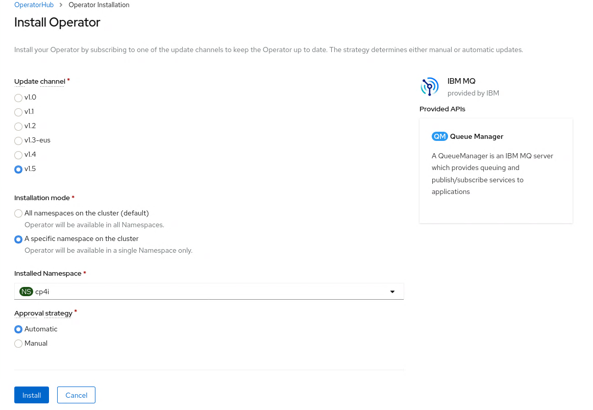
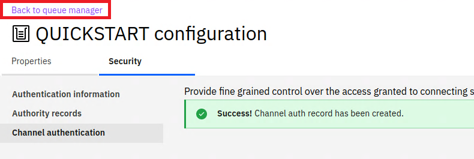

# Getting Started with MQ on Cloud Pak for Integration 2020.2

These instructions document how to setup MQ within Cloud Pak for Integration which is accessible from within the OpenShift Cluster. 
The instructions have been created using a fresh OpenShift environment deployed on AWS however the process should be similar on other environments.

# Pre-requisites
You have installed the OpenShift command line utility *oc*. If you have not, following these [instructions](https://docs.openshift.com/container-platform/4.4/cli_reference/openshift_cli/getting-started-cli.html).

# Installing the IBM Common Services and IBM Operator Catalog
The Cloud Pak for Integration uses IBM Common Services for capabilities such as single sign on and metering. 
Therefore these need to be added to the Operator catalog. 
1. Log into the OpenShift environment and click the plus icon, in the top right:    
        
1. Copy the following into the YAML editor and click *Create*:   
    ```
    apiVersion: operators.coreos.com/v1alpha1
    kind: CatalogSource
    metadata:
      name: opencloud-operators
      namespace: openshift-marketplace
    spec:
      displayName: IBMCS Operators
      publisher: IBM
      sourceType: grpc
      image: docker.io/ibmcom/ibm-common-service-catalog:latest
      updateStrategy:
        registryPoll:
          interval: 45m
    ```   

The Cloud Pak for Integration is deployed using operators and to make these available within your environment you need to install the catalog. 
1. Click the plus icon, in the top right:    
        
1. Copy the following into the YAML editor and click *Create*:     
   ```
   apiVersion: operators.coreos.com/v1alpha1
   kind: CatalogSource
   metadata:
     name: ibm-operator-catalog
     namespace: openshift-marketplace
   spec:
     displayName: ibm-operator-catalog 
     publisher: IBM Content
     sourceType: grpc
     image: docker.io/ibmcom/ibm-operator-catalog
     updateStrategy:
       registryPoll:
         interval: 45m
   ```     
   


# Installing the Cloud Pak for Integration 
IBM Cloud Pak for Integration can be installed via a umbrella operator called the *Cloud Pak for Integration* however there is a known
issue at the moment documented [here](https://www.ibm.com/support/pages/node/6233896). 
I have therefore installed only the components required for CP4I and MQ.

1. Within the OpenShift Web Console select Home --> Projects, and click on *Create Project*:      
        
1. Fill in *cp4i* as the project name, and click *Create*:       
   
1. The images for CP4I are located From a terminal window where you have configured the OpenShift command line utility *oc*, run the following command:     
   ```
   oc create secret docker-registry ibm-entitlement-key --docker-server=cp.icr.io --docker-username=cp --docker-password=<YOUR ENTITLEMENT_KEY> --docker-email=callumj@uk.ibm.com -n cp4i
   ```
1. Navigate to Operators --> Operator Hub, search for *Cloud Pak*, select *IBM Cloud Pak for Integration Platform Navigator*, and click subscribe:      
         
1. Click *Install*
1. Select the *A specific namespace on the cluster* and change the namespace to *cp4i*:      
       
1. This will install three operators within the cp4i namespace and once these are installed (a couple of minutes) it should look like the following:       
       
1. The IBM MQ operator now needs to be installed, navigator to  Operators --> Operator Hub, search for *IBM MQ*:    
          
1. Click *Install*     
1. Select the *A specific namespace on the cluster*, change the namespace to *cp4i*, and click subscribe:      
         
1. An instance of the Platform Navigator needs to be deployed using the Platform Navigator operator, select *IBM Clould Pak for Integration Platform Navigator*:       
         
1. Select the *Platform Navigator* tab and click on *Create PlatformNavigator*:      
        
1. In the YAML editor change the *accept: false* to *true* and click *Create*:   
        
1. The platform navigator will then we deployed and the status changes to *Condition: Ready* once it is available (this can take 15 minutes or so as IBM Common Services needs to be installed). At this stage you can click into the entry, open the Platform Navigator UI by clicking on the link:       
      
1. This will open the Platform Navigator and request you to enter a username and password, the default admin password can be found by running the following: ```oc -n ibm-common-services get secret platform-auth-idp-credentials -o jsonpath='{.data.admin_password}' | base64 -d```:     
         


# Deploying IBM MQ for internal consumers
1. Within the Cloud Pak for Integration Platform Navigator click on Runtimes and Instances, and select Create Instance:     
         
1. Select the MQ Queue Manager tile:    
       
1. Select the *Quick start* tile and click *Next*
1. Accept the license and and click *Create* to deploy a new Queue Manager:     
   
1. You will be returned to the Runtime and Instances list, MQ will take a few seconds to deploy and the status will change to *Ready*. You may need to refresh the status by using the table refresh button:     
   
1. Select the newly created entry and you will be redirected to the MQ Console:      
   
1. Click on the manage button to view the details of the Queue Manager:     
    
1. We will test MQ by sending a message to a queue, for this a new queue will be created, click on *Create +*:    
        
1. Select the *Local* queue type:      
   
1. Fill in *app1* as the Queue Name and click *Create*:     
   
1. A MQ channel needs to be defined for communication into MQ, select the *Communication* tab, *App channel* section and click *Create +*:       
        
1. Click *Next*     
1. Enter *QUICKSTART* as the channel name (as this will match the Queue Manager), and click *Create*:     
   
1. By default MQ is secure and will block all communication without explicit configuration. 
We will allow all communication for the newly created channel. Click on *Configuration* in the top right:      
           
1. Select the *Security* tab, *Channel authentication* section and click *Create +*:       
         
1. We will create a channel auth record that blocks nobody and allows everyone. Select *Block* from the pull down, and the *Final assigned user ID* tile:      
   
1. Enter the following value and click *Create*:     
   * Channel name: *QUICKSTART*
   * User list: nobody       
   
   
   
# Testing MQ
MQ has been deployed within the Cloud Pak for Integration to other containers deployed within the same Cluster. This deployment is NOT accessable externally. Depending on your scenario you can connect ACE / API Connect / Event Streams etc to MQ using the deployed service. This acts as an entry point into MQ within the Kubernetes Cluster. Assuming you used the defaults within the deployment the hostname will be *quickstart-cp4i-ibm-mq*. To verify the installation we will use an MQ client sample within the deployment.         
1. Return to the OpenShift Console, navigate to Workload --> Pods and type *quicks* in the search bar:      
    
   And select the *quickstart-cp4i-ibm0mq-0* entry.
1. Change to the terminal tab which will automatically log you into the Queue Manager container:      
        
1. Run the following commands to send a message to app1queue:     
   export  MQSERVER='QUICKSTART/TCP/quickstart-cp4i-ibm-mq(1414)' 
   /opt/mqm/samp/bin/amqsputc app1 QUICKSTART
   
1. Return to the MQ Console and navigate back to the queue manager view by clicking on *Back to Queue Manager*:      
         
1. Select the app1 queue:      
         
1. You will then see the message sent:      
   
