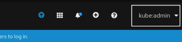

# Deploy an MQ Queue Manager with LDAP automatically configured
This lab will guide you through how to create a MQ container with the configuration for LDAP. 

## Pre-reqs
To run the following you need to have installed:
* The MQ client or server as it uses GSKit and shipped MQ utilities
* The IBM Common Services, IBM Operator Catalog and Cloud Pak for Integration. [Instructions on how to install them.](https://github.ibm.com/CALLUMJ/MQonCP4I/tree/master/instructions/cp4i2020.2/gettingstarted)
* You also need to have set up openLDAP on OpenShift 4.2.  [Instructions on how to set it up.](https://github.ibm.com/CALLUMJ/OpenLDAP)
 
## Step 1 - Download OpenLDAP github repository
- Option 1: clone this repository using `git`:
   ```sh
   git clone git@github.ibm.com:CALLUMJ/OpenLDAP.git
   ```
   **Warning:** You need to setup ssh access to github.ibm.com prior to running this command, see https://github.ibm.com/settings/tokens or https://github.ibm.com/settings/ssh for details. 
- Option 2: Download the repository as a .zip file and navigate to it on your terminal.

## Step 2 - Deploy LDAP into OpenShift
1. Once you have cloned/downloaded the github repository, navigate to the *OpenLDAP/kubernetes* directory.

1. Log into the OpenShift environment, and then click on your username on the top right menu. Then click on **Copy Login Command**. Click on **Display Token**, copy the token and run on your terminal.
OpenShift environment.
   

1. Run the **./installldap.sh** command. This runs an entire build on OpenShift and it creates a brand new image that we will deploy out for MQ. It can take a few minutes to complete this process.
   
   
## Step 3 - Download this github repository
- Option 1: clone this repository using `git`:
   ```sh
   git clone git@github.ibm.com:CALLUMJ/MQonCP4I.git
   ```
   **Warning** you need to setup ssh access to github.ibm.com prior to running this command, see https://github.ibm.com/settings/tokens or https://github.ibm.com/settings/ssh for details. 
- Option 2: Download the repository as a .zip file and navigate to it on your terminal.

## Step 4 - Deploy the MQ Queue Manager with associated resources
1. Run the command: **oc project cp4i** to navigate to the cp4i project.

1. To start deploying, navigate to *../deploy* directory and run **./install.sh** command. Four new files will be created including *mqldap.yaml_template* - this file includes all of the configuration which you have just installed to your OpenShift environment.
   

1. To check that your MQ is running, run the **oc describe queuemanagers** command. It should show "Running" next to Phase.
   

## Step 5 - Test the deployment
Navigate to *../test* directory. You will find three files: CCDT.JSON, getMessage.sh, and sendMessage.sh. Open them in any text editor.

1. In the CCDT.JSON file, you need to update the host next to *host:* with your own host name. To get your host name, run the **oc get routes | grep mtlsqm** command on your terminal. Your host name should start with *ldapmq-ibm-mq-qm*:
   

1. In the getMessage.sh and sendMessage.sh files, you need to replace the first three parts of the paths in the two export commands in each file. To get the new path, run the **pwd** command on your terminal and copy the first three parts of the path. It should look something similar to: *home/name/2020.2*.
   *Warning:* Do not change the value for MQSAMP_USER_ID. It should remain set to *mqapp*.
   

1. To initiate the testing, run the **./sendMessage.sh** command. It will then connect to MQ and ask you for a message to send. Then run the **./getMessage.sh** and it should show you the message that you just sent.
   

1. You can clean up after this process by navigating to the *../deploy* directory and running the command **./cleanup.sh**. This will delete everything.
