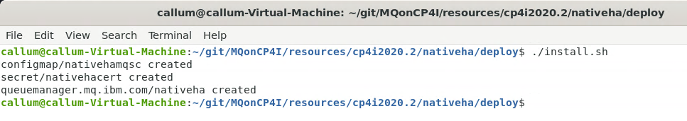
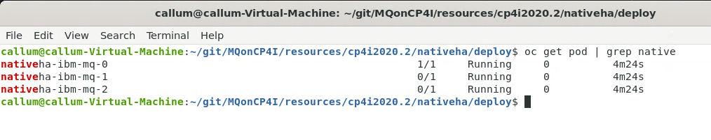
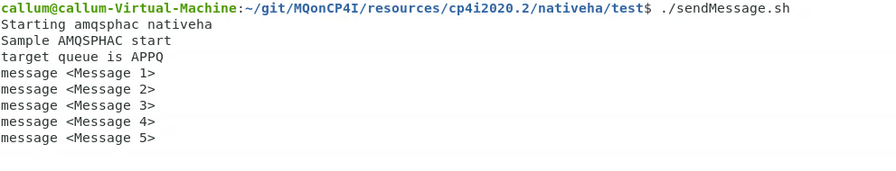
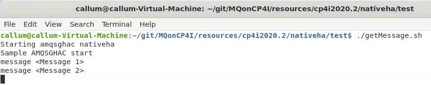
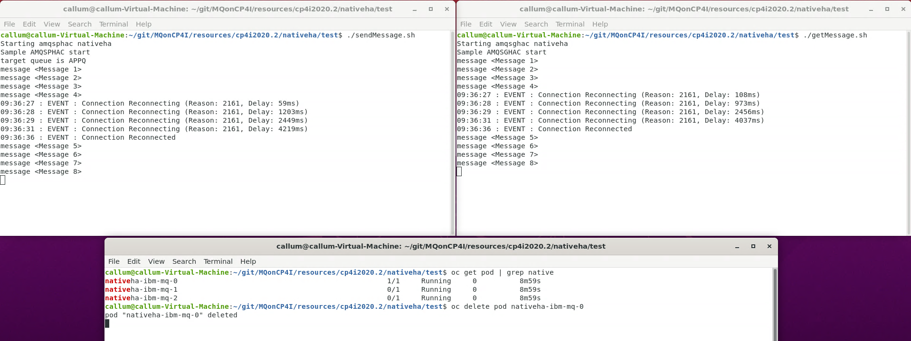
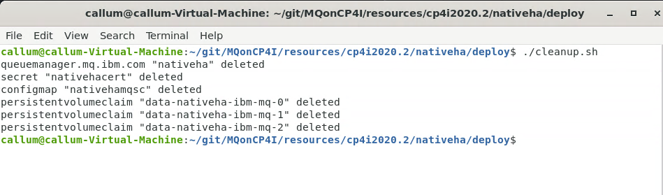

# NativeHA: Deploying a Cloud Native HA persistent IBM MQ Queue Manager on the Cloud Pak for Integration
These instructions will document the process to deploy a NativeHA highly available (HA) persistent IBM MQ on the Cloud Pak for Integration (CP4I) 2021.1.1 (which is currently an early release).

## Pre-reqs
To run the following you need to have installed:
* The MQ client or server as it uses GSKit and shipped MQ utilities
* The IBM Cloud Pak foundational services, IBM Operator Catalog and Cloud Pak for Integration. [Instructions on how to install them.](https://github.ibm.com/CALLUMJ/MQonCP4I/tree/master/instructions/cp4i2020.2/gettingstarted)

## Step 1 - Download this GitHub repository
- Option 1: clone this repository using `git`:
   ```sh
   git clone git@github.ibm.com:CALLUMJ/MQonCP4I.git
   ```
   **Warning:** You need to setup ssh access to github.ibm.com prior to running this command, see https://github.ibm.com/settings/tokens or https://github.ibm.com/settings/ssh for details.
- Option 2: Download the repository as a .zip file and navigate to it on your terminal.

## Step 2 - Deploy the MQ Queue Manager with associated resources
1. Once you have cloned/downloaded the GitHub repository, navigate to the *MQonCP4I/resources/cp4i2020.2/nativeha* directory.

1. Log into the OpenShift environment, and then click on your username on the top right menu. Then click on **Copy Login Command**. Click on **Display Token**, copy the token and run on your terminal.
OpenShift environment.
   

1. Run the command: **oc project cp4i** to navigate to the cp4i project.

1. To start deploying, navigate to *../deploy* directory and run **./install.sh** command. A new file will be created called *nativeha.yaml* - this file includes all of the configurations which you have just installed to your OpenShift environment.
   

1. To view your running pods, run the **oc get pod | grep native** command. The pod that shows 1/1 next to it is the one that is Active while the pods that shows 0/1 are followers.
   

## Step 3 - Test the deployment
Navigate to *../test* directory. No modifications should be required, as the endpoint configuration for your environment will automatically be pulled.

1. To initiate the testing, run the **./sendMessage.sh** command. It will then connect to MQ and start sending messages incessantly.
   

1. Open another command window and run the **./getMessage.sh** command. You should get a list of the all messages that have been previously sent before running the command and the ones that are being sent after.
   

1. To see how the pods work together in action, run the **oc get pod | grep native** command on your terminal to view the current pods, and then delete the running pod by running the command: **oc delete pod nativemqemq-ibm-mq-0**. Once the active pod is deleted, the connection will then reconnect to the other pod for it to take over.
   

1. You can clean up after this process by navigating to the *../deploy* directory and running the command **./cleanup.sh**. This will delete everything.
   
