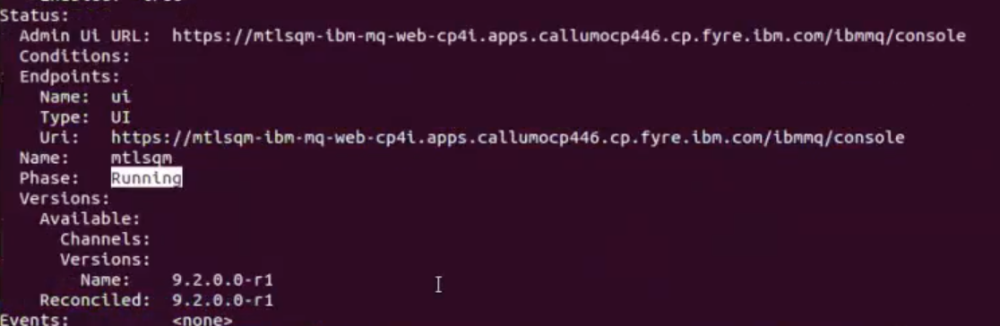
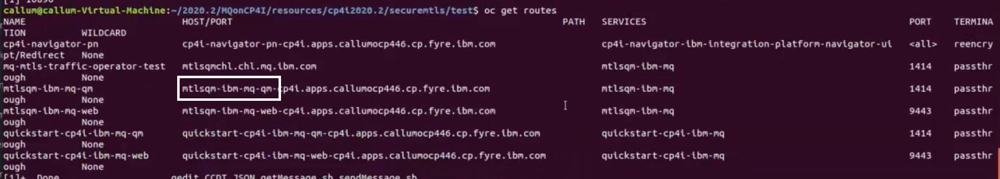
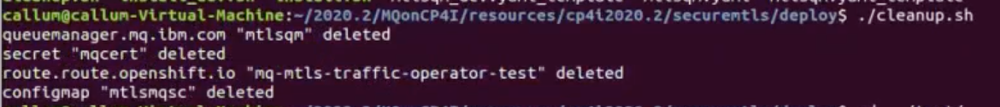
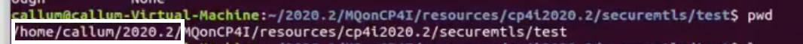

# Securing IBM MQ using mutual TLS
IBM MQ can be secured in a number of ways, two common approaches include:
* Username / Password
* Mutual TLS

This lab will demonstrate how you can use mutual TLS for authentication and authorization. 
The lab is dependant on a number of resources included within this GitHub repository. 

## Pre-reqs
To run the following you need to have installed:
* The MQ client or server as it uses GSKit and shipped MQ utilities
* OpenSSL to generate the raw certificates and keys
* The IBM Common Services, IBM Operator Catalog and Cloud Pak for Integration. [Instructions on how to install them.](https://github.ibm.com/CALLUMJ/MQonCP4I/tree/master/instructions/cp4i2020.2/gettingstarted)

## Step 1 - Download this github repository
- Option 1: clone this repository using `git` with HTTPS URL (recommended):
```sh
git clone https://github.ibm.com/CALLUMJ/MQonCP4I.git
```
or using `git` via SSH if prefer:
```sh
git clone git@github.ibm.com:CALLUMJ/MQonCP4I.git
```
- Option 2: Download the repository as a .zip file and navigate to it on your terminal.

## Step 2 - Optionally re-generate the TLS Certificates and Keys
Once you have cloned/downloaded the github repository, navigate to the */MQonCP4I/resources/cp4i2020.2/securemtls/createcerts* directory.


Run the command **rm appl\* serv\*** to delete all the existing default TLS certificates and keys.

Then run the command **./generate-test-cert.sh** to generate new unique TLS certificates and keys.


## Step 3 - Deploy the MQ Queue Manager with associated resources
Log into the OpenShift environment, and then click on your username on the top right menu. Then click on **Copy Login Command**. Click on **Display Token**, copy the token and run on your terminal.

Run the command: **oc project cp4i**.

To start deploying, navigate to *../deploy* directory and run **./install.sh** command. Three new files will be created including *mtlsqm.yaml* - this file includes all of the configuration which you have just installed to your OpenShift environment.


To check the status of your queue manager, you can run the **oc describe queuemanager ***nameOfYourQueueManager***. It should show *Running*. 


## Step 4 - Test the deployment
Navigate to *../test* directory. You will find three files: CCDT.JSON, getMessage.sh, and sendMessage.sh. Open them in any text editor.

1. In the CCDT.JSON file, you need to update the host next to *host:* with your own host name. To get your host name, run the **oc get routes | grep mtlsqm** command on your terminal. Your host name should start with *ibm-mq-qm* in the second part of it.


2. In the getMessage.sh and sendMessage.sh files, you need to replace the beginning of the paths in the two export commands in each file. Run **pwd** command on your terminal and copy the first three parts of the path. Should look something similar to the *home/name/2020.2* directory.


To initiate the testing, run the **./sendMessage.sh** command. It will then connect to MQ and ask you for a message to send. Then run the **./getMessage.sh** and it should show you the message that you just sent.

You can clean up after this process by navigating to the *../deploy* directory and running the command **./cleanup.sh**. This will delete everything.

