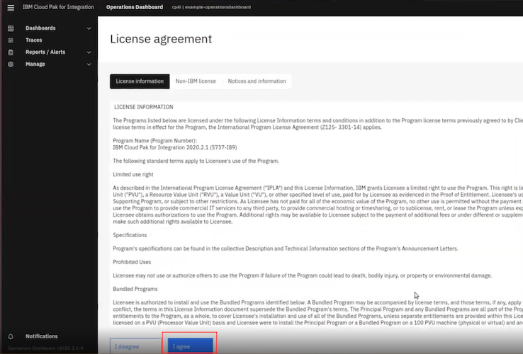
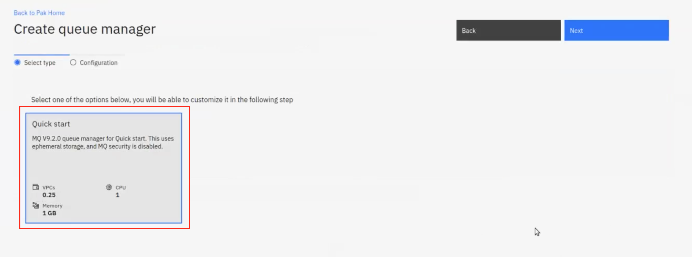
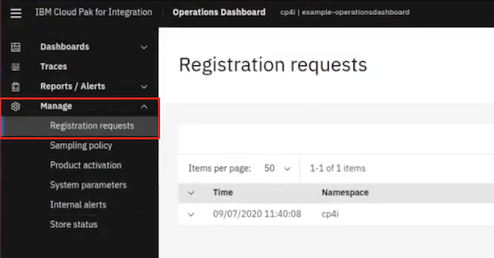
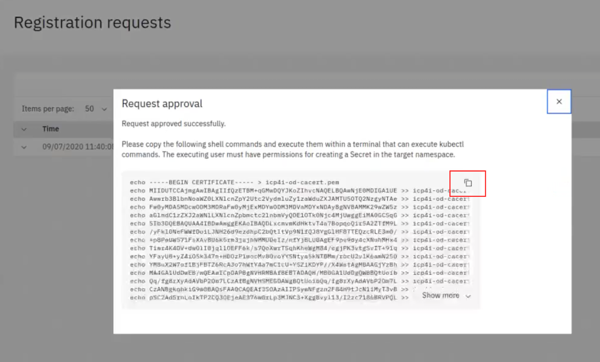

# Installing and setting up the IBM Cloud Pak for Integration Operations Dashboard
These instructions document how to setup MQ within Cloud Pak for Integration, and then setting up the Cloud Pak Operations Dashboard. The instructions have been created using a fresh OpenShift environment deployed on AWS however the process should be similar on other environments.

You will be able after this lab to have an Operations Dashboard on your IBM Cloud Pak to view real-time updates of your queue managers.

# Pre-requisites
You have installed the OpenShift command line utility *oc*. If you have not, follow these [instructions](https://docs.openshift.com/container-platform/4.4/cli_reference/openshift_cli/getting-started-cli.html).

# Installing the IBM Common Services and IBM Operator Catalog
The Cloud Pak for Integration uses IBM Common Services for capabilities such as single sign on and metering. 
Therefore these need to be added to the Operator catalog. 
1. Log into the OpenShift environment and click on the plus icon, in the top right:    
        
1. Copy the following into the YAML editor and click *Create*:   
    ```
    apiVersion: operators.coreos.com/v1alpha1
    kind: CatalogSource
    metadata:
      name: opencloud-operators
      namespace: openshift-marketplace
    spec:
      displayName: IBMCS Operators
      publisher: IBM
      sourceType: grpc
      image: docker.io/ibmcom/ibm-common-service-catalog:latest
      updateStrategy:
        registryPoll:
          interval: 45m
    ```   

The Cloud Pak for Integration is deployed using operators and to make these available within your environment you need to install the ibm operator catalog. 
1. Click the plus icon, in the top right:    
        
1. Copy the following into the YAML editor and click *Create*:     
   ```
   apiVersion: operators.coreos.com/v1alpha1
   kind: CatalogSource
   metadata:
     name: ibm-operator-catalog
     namespace: openshift-marketplace
   spec:
     displayName: ibm-operator-catalog 
     publisher: IBM Content
     sourceType: grpc
     image: docker.io/ibmcom/ibm-operator-catalog
     updateStrategy:
       registryPoll:
         interval: 45m
   ```     
   


# Installing the Cloud Pak for Integration 
IBM Cloud Pak for Integration can be installed via an umbrella operator called the *Cloud Pak for Integration*, however, there is a known
issue at the moment documented [here](https://www.ibm.com/support/pages/node/6233896). 
I have therefore installed only the components required for CP4I, Operations Dashboard and MQ.

1. Within the OpenShift Web Console select Home --> Projects, and click on *Create Project*:      
        
1. Fill in *cp4i* as the project name, and click *Create*:       
   
   
1. The images for CP4I are located in the IBM Entitled Registry. To access these, you will need to configure an API Key within the OpenShift Environment. This can be retrieved from the IBM website here: https://myibm.ibm.com/products-services/containerlibrary. In the Entitlement keys section, select Copy key to copy the entitlement key to the clipboard. This key needs to be associated with the OpenShift environment, to do this open a terminal window where you have configured the OpenShift command line utility *oc*, run the following command:     
   ```
   oc create secret docker-registry ibm-entitlement-key --docker-server=cp.icr.io --docker-username=cp --docker-password=<YOUR ENTITLEMENT_KEY> --docker-email=callumj@uk.ibm.com -n cp4i
   ```
1. Navigate to Operators --> Operator Hub, search for *Cloud Pak*, select *IBM Cloud Pak for Integration Platform Navigator*:      
         
1. Click *Install*
1. Select the *A specific namespace on the cluster* and change the namespace to *cp4i* and then click on subscribe:      
       
1. This will install three operators within the cp4i namespace and once these are installed (a couple of minutes) it should look like the following:       
       
1. The IBM MQ operator now needs to be installed, navigator to  Operators --> Operator Hub, search for *IBM MQ*:    
          
1. Click *Install*     
1. Select the *A specific namespace on the cluster*, change the namespace to *cp4i*, and click Subscribe:      
         
1. An instance of the Platform Navigator needs to be deployed using the Platform Navigator operator, select *IBM Cloud Pak for Integration Platform Navigator*:       
         
1. Select the *Platform Navigator* tab and click on *Create PlatformNavigator*:      
        
1. In the YAML editor change the *accept: false* to *true* and click *Create*:   
        
1. The platform navigator will then be deployed and the status changes to *Condition: Ready* once it is available (this can take 15 minutes or so as IBM Common Services needs to be installed).

1. The Operations Dashboard now needs to be installed, navigator to Operators --> Operator Hub, search for The IBM Cloud Pak for Integration Operations Dashboard:
   
   
1. Click *Install*

1. Select the *A specific namespace on the cluster*, change the namespace to *cp4i*, and click subscribe:      
   
   
1. Go back to the Platform Navigator and can click into the entry (cp4i-navigator), open the Platform Navigator UI by clicking on the entry's hyperlink:
      
   
1. This will open the Platform Navigator and request you to enter a username and password, the default admin password can be found by running the following: ```oc -n ibm-common-services get secret platform-auth-idp-credentials -o jsonpath='{.data.admin_password}' | base64 -d```:     
    

# Creating the Operations Dashboard capability
1. Within the Cloud Pak for Integration Platform Navigator click on *Create capability* under Capabilities.
   
   
1. Select the *Operations Dashboard* tile and click *Next*:    
   
   
1. Select the *example-operationsdashboard* tile and click *Next*:
   
   
1. Change both *Config DB storage class name* and *Store storage class name* to your storage class, in the case of AWS it is *gp2* and click *Create*:
   
   
1. This will create the Operations Dashboard. The capability's status will always remain *Pending* and will take approximately 5 minutes to start running.
   
   
1. Once it is *Ready*, click on the capability to access the Operations Dashboard.
   

1. Read the license carefully and then click on *I agree* once finished:
   
   
1. Click on the hamburger menu on the top left and then click on *Integration Home*:
   
   
1. Now we will deploy an MQ instance to show it. We can do this in a number of different ways, in this lab, we will use the GUI instead of the command line.

1. Click on *Create instance* under *Runtimes* on the Dashboard.
   
   
1. Select the *Queue manager* tile and Click *Next*:
   
   
1. Select the *Quick start* tile and Click *Next*:
   
   
1. Accept the license and then click on *Tracing* from the left menu:     
   
   
1. From the Tracing section, Enable Tracing by switching it on and then change the Tracing Namespace to *cp4i* and finally click *Next*:
   
   
1. IBM MQ will request access to the operations dashboard and will NOT deploy until this is approved. Click on the hamburger menu on the top left and then click on *Operations Dashboard* and then click on the dashboard that you have deployed out:    
   
   
1. From the right menu and under *Manage*, click on *Registration requests*:
   
   
1. MQ has tried to deploy out and it has then sent a message to the Operations Dashboard to request access. To approve it, click on *Approve* next to the request.
   
   
1. Click on the copy icon from the popup to copy the command line to your clipboard:
   
   
1. Run the command in your terminal (the same one used in the previous steps):
   
   
1. Go back to the Integration Home. Under Runtimes, you will notice after approximatly 30 seconds that the status of the MQ instance that you have created is now *Ready*.
   

# Testing the Operations Dashboard
1. From *Runtimes* on Integration Home, click on the instance that you have created to access the queue manager.

1. You need to create a queue. Click on the *Manage QUICKSTART* tile.
   
   
1. This will show you a list of the queues that are available. Click on *Create* to create a new queue.
   

1. Select the *local* tile.
   
   
1. Fill in *APPQ* for the Queue name:
   
   
1. The IBM MQ Console sends MQ messages to the Queue Manager to create the Queue. These messages will also be tracked my the operations dashboard. To avoid any additional testing we will view these in the operations dashboard.

1. Head over to the Operations Dashboard to see the updates. You will be able to see what is happening in real-time.
   
