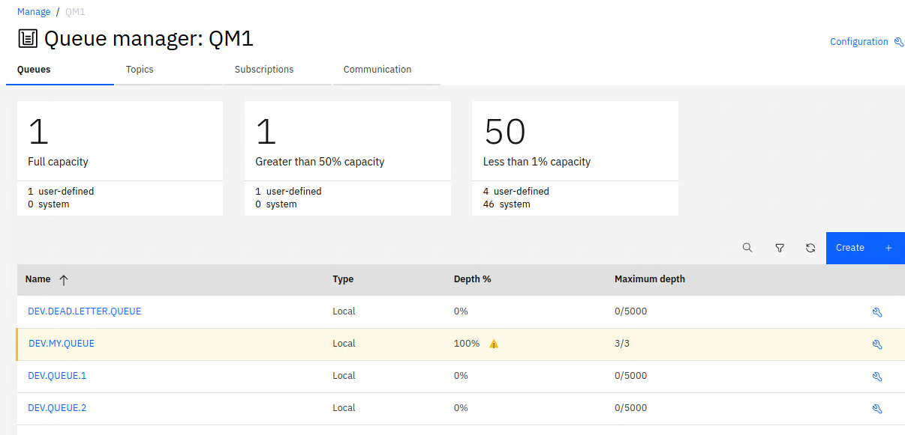

# Basic Administration within IBM MQ
This lab will guide you through some of the core concepts of Administrating IBM MQ, and separate into the following sections:    

* Understanding the basics of problem determination
  * Causing an error
  * Mapping from return code to human readable
  * Viewing IBM MQ error logs
* Using the command line to administer IBM MQ
* Understanding the different types of Queues
* System Objects and User Defined

## Pre-requisites
You have already complete the [Starting IBM MQ within a container lab](https://github.ibm.com/CALLUMJ/MQonCP4I/blob/master/instructions/docker/ReadySetConnect.md#starting-ibm-mq-within-a-container) and [Testing the environment using the Web Console and command line](https://github.ibm.com/CALLUMJ/MQonCP4I/edit/master/instructions/docker/WebConsole101.md).

## Understanding the basics of problem determination
This section will understand highlight the basics of IBM MQ problem determination, we will deliberately cause an error to demonstrate the various capabilities that exist to resolve the problem. 

### Resolving an error using the Web Console and mqrc command
In the previous lab we created a queue called *DEV.MY.QUEUE* and set the maximum depth to be 3 messages. 
In this section we will demostrate what happens when you attempt to exceed the limit.    
1. We will complete this testing using the command line. Open a new terminal window:    
          

1. We will exec into the running container but to do this we need to determine the container ID. This can be found by running:       
   ```
   docker ps
   ```

   You should see output like this:
   ```
   CONTAINER ID        IMAGE               COMMAND             CREATED             STATUS              PORTS                                                      NAMES
   9b389a6f9d69        ibmcom/mq:latest    "runmqdevserver"    2 minutes ago       Up 2 minutes        0.0.0.0:1414->1414/tcp, 0.0.0.0:9443->9443/tcp, 9157/tcp   upbeat_goldstine
   ```

1. Copy your own container id (from the previous step) and use it to get command line access inside the container, for example:     
   ```
   docker exec -ti <your container id> /bin/bash
   ```        

   You should see output like this:        

   ```
   bash-4.4$
   ```      

1. IBM MQ ships sample applications that can be used to test and verify your environment. These can be found in the following location ```/opt/mqm/samp/bin```. These are samples that can be used as provided, and the source code is provided as reference allowing users to customize based on their requirements. The source can be found in the parent directory: ```/opt/mqm/samp```. A full list of the samples can be found [here](https://www.ibm.com/support/knowledgecenter/en/SSFKSJ_9.1.0/com.ibm.mq.dev.doc/q023900_.htm). Within this lab we will use *amqsput*. This allows us to connect to a local queue manager and PUT messages to a queue. Lets try it out, change to the sample bin directory:     
   ```
   cd /opt/mqm/samp/bin
   ```
1. Run the command to place the first message:   
   ```
   echo "Test message 1" | ./amqsput DEV.MY.QUEUE QM1
   ```      
   This should complete with the following output:      
   ```
   Sample AMQSPUT0 start
   target queue is DEV.MY.QUEUE
   Sample AMQSPUT0 end
   ```
1. Repeat this another 3 times and on the final attempt you should see an error:      
   ```
   bash-4.4$ echo "Test message 2" | ./amqsput DEV.MY.QUEUE QM1
   Sample AMQSPUT0 start
   target queue is DEV.MY.QUEUE
   Sample AMQSPUT0 end

   bash-4.4$ echo "Test message 3" | ./amqsput DEV.MY.QUEUE QM1
   Sample AMQSPUT0 start
   target queue is DEV.MY.QUEUE
   Sample AMQSPUT0 end

   bash-4.4$ echo "Test message 4" | ./amqsput DEV.MY.QUEUE QM1
   Sample AMQSPUT0 start
   target queue is DEV.MY.QUEUE
   MQPUT ended with reason code 2053
   Sample AMQSPUT0 end
   ```
1. MQ provides an utility program called *mqrc* that converts MQ return codes into a human readable format. This can be a simple way to start the problem determination. In the above case *2053* was returned, run the following to understand what this corresponds to:     
   ```
   mqrc 2053
   ```
   This returns the following:    
   ```
   2053  0x00000805  MQRC_Q_FULL
   ```
1. In addition if you return to the web console and viewed the Queue Manager you will see the maximum depth has been reached and highlighted:     
          

1. Both of the above mechanisms provide a straight forward way to determine the underlying issue. 
In our case we will address this by reading the message, simulating an application coming back on line.        
   ```
   /opt/mqm/samp/bin/amqsget DEV.MY.QUEUE QM1
   ```
   You should see the following output:      
   ```
   bash-4.4$ /opt/mqm/samp/bin/amqsget DEV.MY.QUEUE QM1
   Sample AMQSGET0 start
   message <Test message 1>
   message <Test message 2>
   message <Test message 3>
   ```
   If you now re-attempt the amqsput command this will now work.
 

### Resolving an error using the error log
IBM MQ has a feature rich authentication and authorization capability. In our lab we have not exposed many of these controls but behind the scenes it is still completing these checks. In this section we will change the default user to one that does not have authority to the queues and understand how we can troubleshoot this issue. 

1. The sample programs can be configured to specify a username for the connection by setting an environment variable called: ```MQSAMP_USER_ID```. We will use this to cause an error when we attempt to PUT a message. 
Set the variable using the following command:         
   ```
   export MQSAMP_USER_ID=nouser
   ```
   Now lets try and PUT a message to the queue:      
   ```
   bash-4.4$ echo "Test message 1" | ./amqsput DEV.MY.QUEUE QM1
   Sample AMQSPUT0 start
   Enter password: MQCONNX ended with reason code 2035
   ```
   We can see that this failed with a return code of 2035. We can use the mqrc command to view what this command means:       
   ```
   bash-4.4$ mqrc 2035

      2035  0x000007f3  MQRC_NOT_AUTHORIZED
   ```
   At this stage we can understand that we were not Authorized, but this may be inadequate information to resolve the issue. 
   It is standard practice to provide limited troubleshooting information in the case of a security error as we do not want to assist hackers.
1. Error logs   
## Using the command line to administer IBM MQ

## Understanding the different types of Queues

## System Objects and User Defined

- [ ] Explain where and what the samples are
- [ ] Explain the MQServer environment variable MQUSER
- [ ] Queue Types - Alias and Local Queue 
- [ ] Put / Get inhibit for the Alias - but not the local
- [ ] System Objects vs User Defined
- [ ] Error logs
- [ ] mqrc command 


- [ ] Presentation: MQ Channels
- [ ] Presentation: MQ Networks 


