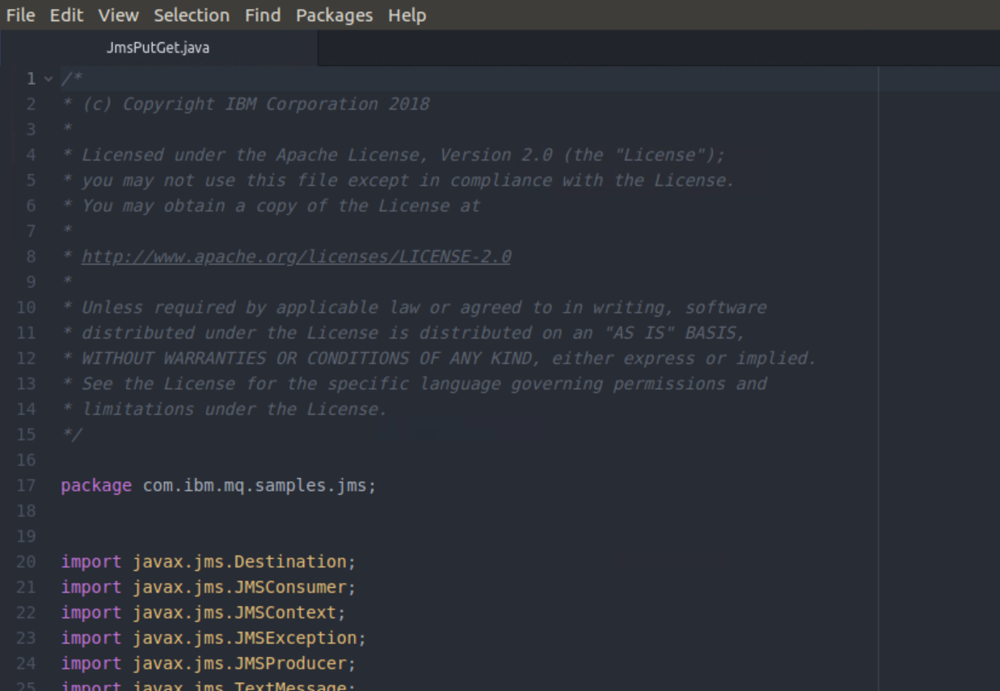

# Develop your first JMS application with MQ

This lab will show how straight forward it is to build your first JMS application that puts and gets messages from a queue. The instructions are seperated into the following: 
1.  [Point to point with JMS and IBM MQ](#Point-to-point-with-JMS-and-IBM-MQ)
2.  [Point to point sample walkthrough](#Point-to-point-sample-walkthrough)
3.  [Compile and run your application](#Compile-and-run-your-application)
4.  [Learn more about JMS](#Learn-more-about-JMS)

## Pre-requisites
You have already complete the [Starting IBM MQ within a container lab](https://github.ibm.com/CALLUMJ/MQonCP4I/blob/master/instructions/docker/ReadySetConnect.md#starting-ibm-mq-within-a-container) and [Testing the environment using the Web Console and command line](https://github.ibm.com/CALLUMJ/MQonCP4I/edit/master/instructions/docker/WebConsole101.md).
In addition if you are using your own machine you will require the following: 
1.  [JMS classes – JMS.jar](https://repo1.maven.org/maven2/javax/jms/javax.jms-api/2.0.1/javax.jms-api-2.0.1.jar)
2.  [IBM and IBM MQ classes for JMS – com.ibm.mq.allclient.jar](https://repo1.maven.org/maven2/com/ibm/mq/com.ibm.mq.allclient/9.1.4.0/com.ibm.mq.allclient-9.1.4.0.jar)
3.  [Java Software Development Kit (JDK)](https://developer.ibm.com/javasdk/downloads/sdk8/) – to develop and run applications
4.  [JmsPutGet.java](https://raw.githubusercontent.com/ibm-messaging/mq-dev-samples/master/gettingStarted/jms/JmsPutGet.java) sample

Create a directory to save the files needed for the sample, for example in your home directory:

    mkdir MQClient

From the MQClient folder, first download the pre-reqs by using wget OR curl:

*   Get the latest version of the IBM MQ com.ibm.mq.allclient.jar:

    ```
    wget https://repo1.maven.org/maven2/com/ibm/mq/com.ibm.mq.allclient/9.1.4.0/com.ibm.mq.allclient-9.1.4.0.jar
    ```

    ```
    curl -o com.ibm.mq.allclient-9.1.4.0.jar https://repo1.maven.org/maven2/com/ibm/mq/com.ibm.mq.allclient/9.1.4.0/com.ibm.mq.allclient-9.1.4.0.jar
    ```

*   Get the latest JMS API jms.jar:

    ```
    wget https://repo1.maven.org/maven2/javax/jms/javax.jms-api/2.0.1/javax.jms-api-2.0.1.jar
    ```

    ```
    curl -o javax.jms-api-2.0.1.jar https://repo1.maven.org/maven2/javax/jms/javax.jms-api/2.0.1/javax.jms-api-2.0.1.jar
    ```

*   If you don’t already have a Java JDK version 8, you can download it from [here](https://developer.ibm.com/javasdk/downloads/sdk8/). Select the right download for your platform and install.

    On Linux, depending on which package you downloaded you need to run it to install. For example, if you downloaded ibm-java-sdk-8.0-5.10-x86\_64-archive.bin, run:

    ```
    ./ibm-java-sdk-8.0-5.10-x86_64-archive.bin
    ```

    Ensure that the JDK is on the system path:

    On Linux:

    ```
    PATH=~/ibm-java-x86_64-80/bin:$PATH
    ```

## Point to point with JMS and IBM MQ

JMS stands for Java Message Service. JMS is a standard that defines how you can access enterprise messaging systems from Java programs. JMS API is implemented by messaging service providers like IBM MQ to allow JMS client applications to access the provider’s messaging service.

Say you want to send data from your application to a single queue.
In this lab, you’ll put a message that holds your data to a queue and the consuming application will get it from the queue.
You’ll be using the JMS API to connect to your messaging provider which in this case is IBM MQ.

Your application has to be able to do these things:

*   Connect to the queue manager
*   Open a queue
*   Put a message
*   Get a message
*   Close the queue
*   Disconnect from the queue manager

We assume that these MQ objects are set up on the MQ server that you are connecting to:

*   Queue manager QM1
*   Queue DEV.QUEUE.1
*   Channel DEV.APP.SVRCONN
*   Port 1414

Adjust accordingly if you are using your own objects.
If you are using the VM provided it should already be configured correctly.

## Point-to-point sample walkthrough

1. Lets get the sample from GitHub, save it on your local machine and look through some of the key JMS constructs and where you can add the host, port, channel and queue details so your sample can connect to the queue manager. In your MQClient directory, create the following directory structure: ```com/ibm/mq/samples/jms```
   ```
   cd ~/MQClient
   mkdir -p com/ibm/mq/samples/jms
   ```

1. We will download the sample code from GitHub, run the following commands:       
   ```
   cd com/ibm/mq/samples/jms
   wget https://raw.githubusercontent.com/ibm-messaging/mq-dev-samples/master/gettingStarted/jms/JmsPutGet.java
   ```

1. We will edit the sample code for your environment. Open the sample code using the following:       
   ```
   atom JmsPutGet.java
   ```
   This will load the code in the editor Atom:      
      
   
1. Scroll down to line 56. Here you will see the generic connectivity information used in the sample. This needs to be customized with your own configuration. Replace the existing configuration with the following:          

    ```
    // Create variables for the connection to MQ
    private static final String HOST = "localhost"; // Host name or IP address
    private static final int PORT = 1414; // Listener port for your queue manager
    private static final String CHANNEL = "DEV.APP.SVRCONN"; // Channel name
    private static final String QMGR = "QM1"; // Queue manager name
    private static final String APP_USER = "app"; // User name that application uses to connect to MQ
    private static final String APP_PASSWORD = "password"; // Password that the application uses to connect to MQ
    private static final String QUEUE_NAME = "DEV.QUEUE.1"; // Queue that the application uses to put and get messages to and from
    ```
    *Save* the file.
1. We will now walk through the code to explain what it does. Lines 83-84 create the connection factory programatically by using WMQConstants parameters. WMQConstants refers to MQ specific property names and values that can be set through the client. IBM MQ classes for JMS contain a set of extensions to the JMS API, called [IBM JMS extensions](https://www.ibm.com/support/knowledgecenter/en/SSFKSJ_9.0.0/com.ibm.mq.dev.doc/q032180_.htm). Your application can use these extensions to create connection factories and destinations dynamically, at runtime, and set MQ specific object properties.       
    ```
    // Create a connection factory
    JmsFactoryFactory ff = JmsFactoryFactory.getInstance(WMQConstants.WMQ_PROVIDER);
    JmsConnectionFactory cf = ff.createConnectionFactory();
    ```
    You need to include declarations for the ibm.com connection factory classes and the WMQ Constants classes that all extend JMS classes:       
    ```
    import com.ibm.msg.client.jms.JmsConnectionFactory;
    import com.ibm.msg.client.jms.JmsFactoryFactory;
    import com.ibm.msg.client.wmq.WMQConstants;
    ```
    
    Lines 86-95 create JMS objects that will map to MQ objects. The following MQ Constants properties are used by the connection factory to create a connection when the application is run:     
    ```
    // Set the properties
    cf.setStringProperty(WMQConstants.WMQ_HOST_NAME, HOST);
    cf.setIntProperty(WMQConstants.WMQ_PORT, PORT);
    cf.setStringProperty(WMQConstants.WMQ_CHANNEL, CHANNEL);
    cf.setIntProperty(WMQConstants.WMQ_CONNECTION_MODE, WMQConstants.WMQ_CM_CLIENT);
    cf.setStringProperty(WMQConstants.WMQ_QUEUE_MANAGER, QMGR);
    cf.setStringProperty(WMQConstants.WMQ_APPLICATIONNAME, "JmsPutGet (JMS)");
    cf.setBooleanProperty(WMQConstants.USER_AUTHENTICATION_MQCSP, true);
    cf.setStringProperty(WMQConstants.USERID, APP_USER);
    cf.setStringProperty(WMQConstants.PASSWORD, APP_PASSWORD);
    ```
    
    In production, you would use a JNDI store to look this information up. We’ve mentioned the objects that are set up on the MQ server side. The WMQConstants properties for host name and port map obviously to the MQ server objects. An additional property for the connection factory object is connection mode. We’ll be connecting in client mode. Applications can connect to the queue manager in client or bindings modes. Bindings mode for JMS uses Java Native Interface (JNI) when both the MQ server and client are running in the same environment. Client mode uses the TCP /IP protocol when MQ server and client are running on different environments.

    Lines 97 to 102 show a connection factory being created and the context used to create the destination. Without the JNDI store to look up the destination, pass in the actual queue name that you’re aiming for on the MQ server.
    ```
    // Create JMS objects
    context = cf.createContext();
    destination = context.createQueue("queue:///" + QUEUE_NAME);

    //Set up the message
    long uniqueNumber = System.currentTimeMillis() % 1000;
    TextMessage message = context.createTextMessage("Your lucky number today is " + uniqueNumber);
    ```
    
Include the declarations for the JMS context, destination and the JMS text message:
    ````
    import javax.jms.Destination;
    import javax.jms.JMSContext;
    import javax.jms.TextMessage;
    ````
    Lines 104-106 use the context to create the producer. The producer sends the message using the destination to put the message to the right queue:
    ````
    producer = context.createProducer();
    producer.send(destination, message);
    System.out.println("Sent message:\n" + message);
    ````    
    Include the declaration for the JMS producer:

    ````
    import javax.jms.JMSProducer;
    ````
    
    Lines 108-109 use the context to create the consumer. The consumer uses the destination to receive the message from the right queue.
    ````
    consumer = context.createConsumer(destination); // autoclosable
    String receivedMessage = consumer.receiveBody(String.class, 15000); // in ms or 15 seconds
    ````
    
    Include the declaration for the JMS consumer:
    ````
    import javax.jms.JMSConsumer;
    ````
    The sample also has a couple of class utility methods for printing exceptions.

    Go ahead and include the declaration for the JMS exceptions:

    import javax.jms.JMSException;

    You should now be able to compile your application and run it.

## Compile and run your application

This is where you’ll finally connect your application to the queue manager and put and get messages to and from the queue.

1. To compile the sample, go to your MQClient directory and run the following commands; 
   ```
   cd ~/MQClient
   javac -cp ./com.ibm.mq.allclient-9.1.3.0.jar:./javax.jms-api-2.0.1.jar com/ibm/mq/samples/jms/JmsPutGet.java
   ```
1. To confirm that the sample is compiled list the directory: 
   ```
   ls -l com/ibm/mq/samples/jms/
   
    -rw-r--r-- 1 root root 3788 Apr 6 18:34 JmsPutGet.class
    -rw-r--r-- 1 root root 5099 Apr 6 18:22 JmsPutGet.java
   ```

1. To run your application, execute the following command:      
   ```
   java -cp ./com.ibm.mq.allclient-9.1.3.0.jar:./javax.jms-api-2.0.1.jar:. com.ibm.mq.samples.jms.JmsPutGet
   ```

   You should see output like this:
   ```
    Sent message:

    JMSMessage class: jms\_text
    JMSType:          null
    JMSDeliveryMode:  2
    JMSDeliveryDelay: 0
    JMSDeliveryTime:  1519399851110
    JMSExpiration:    0
    JMSPriority:      4
    JMSMessageID:     ID:414d5120514d312020202020202020208731905a21a55202
    JMSTimestamp:     1519399851110
    JMSCorrelationID: null
    JMSDestination:   queue:///DEV.QUEUE.1
    JMSReplyTo:       null
    JMSRedelivered:   false
        JMSXAppID: JmsPutGet (JMS)
        JMSXDeliveryCount: 0
        JMSXUserID: app
        JMS\_IBM\_PutApplType: 28
        JMS\_IBM\_PutDate: 20180223
        JMS\_IBM\_PutTime: 15305112
    Your lucky number today is 95

    Received message:
    Your lucky number today is 95
    SUCCESS
   ```      
   Congratulations! You wrote, edited and compiled your first JMS application, sent a message to an IBM MQ queue and got it from the queue. You also set up your environment with everything you need to develop with JMS and IBM MQ.
   You have a basic understanding of what you’re aiming to hit on the MQ server side with the objects in your JMS application and how JMS helps you achieve that.

## Learn more about JMS

This tutorial is based on JMS 2.0 or simplified JMS API. Earlier versions can still be used to support backward compatibility. Check out the JMS 2.0 specification [here](http://download.oracle.com/otndocs/jcp/jms-2_0-fr-eval-spec/index.html).

JMS takes messaging objects that are common to different messaging providers and defines them in a way that can be reused regardless of the JMS messaging provider.
It also provides facilities for encapsulating concepts that are specific to each provider, in a way that can minimise how much a developer needs to know about how each messaging provider works.

IBM MQ implements JMS and provides a set of classes that your application can use. You need to have access to these classes as well as the JMS API.

JMS supports two messaging styles, point to point and publish/subscribe.
Components of a JMS application are JMS client, messages, JMS provider and administered objects.
JMS Administered objects are connection factory and destination.

The objects or interfaces that JMS 2.0 provides are the main building blocks for your JMS application:
* Message – BytesMessage, MapMessage, ObjectMessage, StreamMessage, TextMessage.
* Queue – administered object that encapsulates the identity of a message destination for point to point messaging.
* Topic – administered object that encapsulates the identity of a message destination for publish subscribe messaging.
* Destination – the common supertype of Queue and Topic objects.

Connection factory – administered object used by a client to create a connection.
* JMS context – active connection to a JMS Provider and a single threaded context for sending and receiving messages.
* JMS producer – object created by a JMS Context that is used for sending messages to a queue or topic.
* JMS consumer – object created by a JMS Context that is used for receiving messages sent to a queue or topic.

On your client application side, the JMS API provides ways to access messaging provider (MQ) objects.
In production environments, your JMS administered objects would access information about the objects on the provider (MQ server) side, from a JNDI store that is separate from the client and the messaging server. Your application would not use each MQ parameter directly as this means it would be tightly coupled to the queue manager, channel and the queue.
Each time something changed with any of those, you would have to make changes to your application too.
The MQ administrator usually manages a store where connection factory and destination name-object pairs are bound.

Rather than including the information about the queue, queue manager, host and channel in your application directly, you would program the connection factory and destination to look up this information through JNDI.
JMS encourages you to decouple your application from the messaging provider to minimise change and improve maintainability. You also want to decouple your application logic from your messaging provider so that the application is easily portable between providers.

Although JMS is really helping you in the long run by abstracting certain details away from your application, this can make JMS more difficult to understand. In this tutorial, we’ve set up the application to be tightly coupled to the queue manager and queue because this is the easiest way to understand what is happening.

Your application uses the connection factory to create the connection to the queue manager and the destination defines the queue object that you need to use to send messages to the actual MQ queue.
