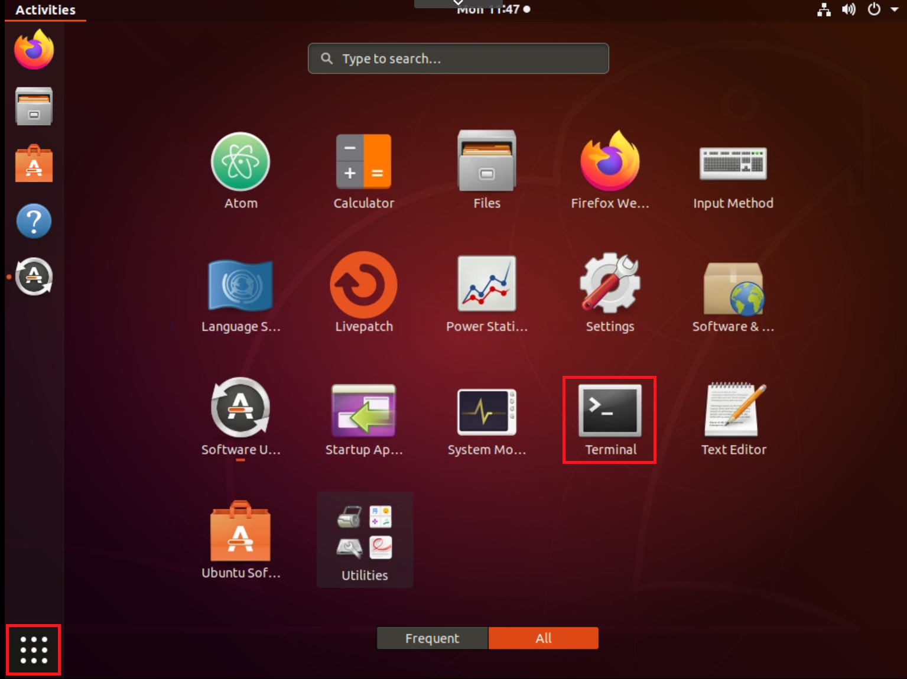

# Starting IBM MQ within a container

This part of the lab will show how straight forward it is to start IBM MQ in a matter of minutes.

## Pre-requisites - Install Docker (pre-completed within supplied image)
--------------

If you already have Docker version 17.06 (or later), continue to the [next section](#Get-the-MQ-in-Docker-image). To find Docker for your platform, go to [Docker Community Edition](https://hub.docker.com/search/?type=edition&offering=community) and install. For example, if you're installing on Ubuntu, instructions are [here](https://docs.docker.com/install/linux/docker-ce/ubuntu/). If your Docker version is called docker or docker-engine, you need to uninstall these before installing the latest docker-ce version. Once you've installed Docker, come back to continue with the tutorial.    


## Get the MQ in Docker image
--------------

Containers are run from images and images are built from a specification listed in a Dockerfile. We will use a pre-built IBM MQ server image from Docker Hub so we can just run our container and end up with a working MQ installation and a pre-configured queue manager. 

1. Open a new terminal window:    
   

1. Pull the image from Docker hub that contains the latest version of the MQ server:       
   ```
   docker pull ibmcom/mq:latest
   ```

1. When it’s done, check which images you have:       
   ```
   docker images
   ```     
   You should see output like this:
   ```
   REPOSITORY          TAG                 IMAGE ID            CREATED             SIZE
   mqbadge             latest              e8d1ec438a2b        2 months ago        945MB
   <none>              <none>              8443345693a7        2 months ago        116MB
   ibmcom/mq           latest              268baf40303f        3 months ago        927MB
   openjdk             8-alpine            a3562aa0b991        10 months ago       105MB
   ```

## Run the container from the image
--------------------------------

Now that the MQ server image is in your local Docker repository, you can run the container to stand up MQ in Ubuntu.

When you stand up a container, a filesystem is used that is deleted when the container is deleted.  
Queue manager and queue data is saved in the filesystem. To avoid losing the queue manager and queue data we can use volumes.  
Volumes are attached to containers when they are run and persist after the container is deleted. When you run a new container you can attach an existing volume and reuse your queue manager and queue data.

1. Use Docker to create a volume:      
   ```
   docker volume create qm1data
   ```    

1. Run the MQ server container. Edit the command to set your own password for connecting applications.        
   ```
   docker run --env LICENSE=accept --env MQ_QMGR_NAME=QM1 --volume qm1data:/mnt/mqm --publish 1414:1414 --publish 9443:9443 --detach --env MQ_APP_PASSWORD=password ibmcom/mq:latest
   ```

   You're creating a queue manager which has been set up with some simple default configuration to help you connect your first client application.      

   We've added parameters to the docker run command, for example to accept the license for IBM MQ Advanced for developers and name the queue manager where our queue will live QM1.        
Because MQ running inside the container would be isolated from the rest of the world, we've opened a couple of ports that MQ uses.  
The queue manager listener listens on port 1414 for incoming connections and port 9443 is used by MQ console.  
The MQ demo client application will use the listener port and MQ Console dashboard can be seen in your browser on port 9443.      

1. Lets check it’s running:
   ```
   docker ps
   ```

   You should see output like this:
   ```
   CONTAINER ID        IMAGE               COMMAND             CREATED             STATUS              PORTS                                                      NAMES
   9b389a6f9d69        ibmcom/mq:latest    "runmqdevserver"    2 minutes ago       Up 2 minutes        0.0.0.0:1414->1414/tcp, 0.0.0.0:9443->9443/tcp, 9157/tcp   upbeat_goldstine
   ```

Congratulations! You've just created your first simple queue manager. It's called QM1 and it's running inside the container.  
To access it, you'll be connecting over TCP/IP, which is why you needed to expose the port 1414.

## Verify the IBM MQ deployment
--------------------------------
To verify the IBM MQ deployment we will exec into the running container and run a couple of commands to make sure everything is healthy.     

1. Copy your own container id (from the previous step) and use it to get command line access inside the container, for example:     
   ```
   docker exec -ti <your container id> /bin/bash
   ```        

   You should see output like this:        

   ```
   (mq:9.1.2.0)mqm@<your container id>:/#
   ```      

1. You can display the MQ Installation and Data paths by running the ‘display MQ version’ command in your command line interface:      
   ```
   dspmqver
   ```    
   You should see output like this:      
   ```
   Name:        IBM MQ
   Version:     9.1.4.0
   Level:       p914-L191127.DE
   BuildType:   IKAP - (Production)
   Platform:    IBM MQ for Linux (x86-64 platform)
   Mode:        64-bit
   O/S:         Linux 4.15.0-74-generic
   O/S Details: Red Hat Enterprise Linux 8.1 (Ootpa)
   InstName:    Installation1
   InstDesc:    
   Primary:     Yes
   InstPath:    /opt/mqm
   DataPath:    /var/mqm
   MaxCmdLevel: 914
   LicenseType: Developer
   ```
   
1. Display your running queue managers:
   ```
   dspmq
   ```     
   You should see output like this:       
   ```
   QMNAME(QM1) STATUS(Running)
   ```
   To come out of the docker container and return to your Linux command line, type:
   ```
   exit
   ```

## Summary
----------
You have downloaded the pre-built Docker image and ran the container to get MQ running on Ubuntu. MQ objects and permissions that the client demo application needs to connect to a queue manager and put and get messages to and from the queue, are created automatically. Docker and MQ are using your host computer resources and connectivity. Inside the container, the MQ installation on Ubuntu has the following objects and permissions set:

*   Queue manager QM1
*   Queue DEV.QUEUE.1
*   Channel DEV.APP.SVRCONN
*   Listener DEV.LISTENER.TCP on port 1414

The queue that you will be using, DEV.QUEUE.1, 'lives' on the queue manager QM1.  
The queue manager also has a listener that listens for incoming connections, for example, on port 1414.  
Client applications connect to the queue manager and can open, put, and get messages, and close the queue.  
Applications use an MQ channel to connect to the queue manager. Access to these three objects is restricted in different ways.  
For example, user 'app', who is a member of the group ‘mqclient’ is permitted to use the channel ‘DEV.APP.SVRCONN’ to connect to the queue manager QM1 and is authorised to put and get messages to and from the queue DEV.QUEUE.1.  
All the MQ objects and permissions that the demo application needs are created and configured when you run the MQ server container.
