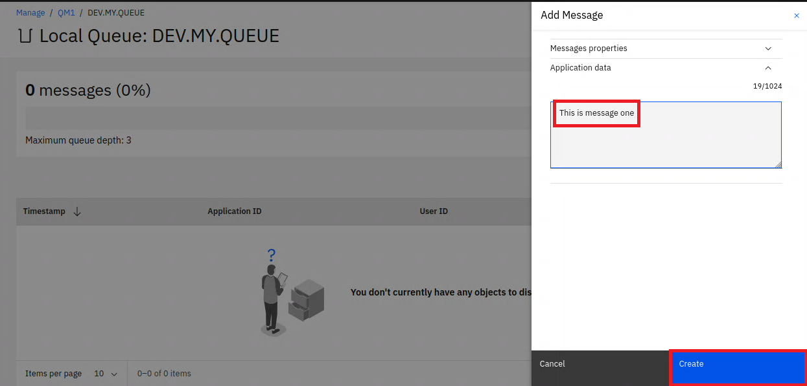
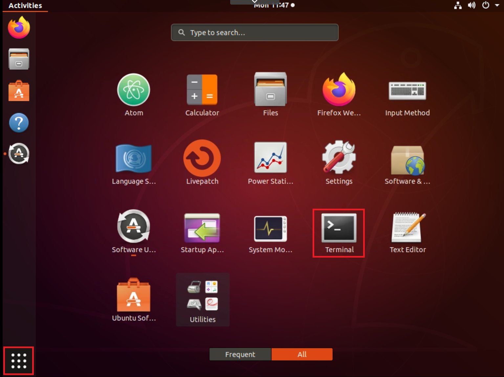

# Testing the environment using the Web Console and command line
This lab will use the new IBM MQ Web Console and the command line available in 9.1.5 to verify the environment. 

## Pre-requisites
You have already complete the [Starting IBM MQ within a container lab](https://github.ibm.com/CALLUMJ/MQonCP4I/blob/master/instructions/docker/ReadySetConnect.md#starting-ibm-mq-within-a-container).

## Starting the Web Console and creating a message
When the container image was started it exposed two ports: one for MQ traffic (1414) and another for the web console (9443). 
These steps will start the web console on a browser within the remote virtual machine.
1. Start Firefox by click on the icon on the left:     
       
1. Navigate to ```https://localhost:9443```. This will open the IBM MQ Web Console. 
Commonly the first time you attempt to access the MQ console a warning will appear regarding the certificate. 
This can be accepted as it is due to a self-signed certificate. 
In a real production environment this would commonly be configured with a certificate that would be known by the browser.      
   
1. The default IBM MQ Web Console will be displayed, login using the following credentials:
   * Username: admin
   * Password: passw0rd 
   Click *login*
        
1. Select the manage icon on the left hand side:     
        
1. The Queue Manager details will be displayed. 
Initially you will see the user defined queues, and will immediately see the four queues that have automatically been defined for you.    
      
   We will create a new queue for our testing, select *Create*.
1. In a later lab we will discuss the different type of Queue, but lets select *Local* at the moment:     
      
1. Fill in the following details:     
   * Queue name: *DEV.MY.QUEUE*
   * Max queue depth: *3*     
   We are deliberately reducing the queue depth to a low number so we can simulate failure situations. Click *Create* to complete the process:       
      
1. The table will show the newly created queue, click on the *DEV.MY.QUEUE* text:       
      
1. This shows what messages are currently available on the queue, and as we have just created the new queue it is currently empty. 
Lets create a new message. Select *Create*:       
      
1. A pop-out from the right will appear, enter some text and click *Create*:       
      
   The view of messages will automatically be updated to show the new message:       
           
   
## Using the command line to create and consume messages
1. Open a new terminal window:    
          

1. We will exec into the running container but to do this we need to determine the container ID. This can be found by running:       
   ```
   docker ps
   ```

   You should see output like this:
   ```
   CONTAINER ID        IMAGE               COMMAND             CREATED             STATUS              PORTS                                                      NAMES
   9b389a6f9d69        ibmcom/mq:latest    "runmqdevserver"    2 minutes ago       Up 2 minutes        0.0.0.0:1414->1414/tcp, 0.0.0.0:9443->9443/tcp, 9157/tcp   upbeat_goldstine
   ```

1. Copy your own container id (from the previous step) and use it to get command line access inside the container, for example:     
   ```
   docker exec -ti <your container id> /bin/bash
   ```        

   You should see output like this:        

   ```
   bash-4.4$
   ```      

1. MQ provides a number of sample applications that can be used to test the setup from the command line. 
One is *amqsget*, this GETs messages from a queue. Lets verify that we can get the message we just created in the web console. 
Run the following command:       
   ```
   /opt/mqm/samp/bin/amqsget DEV.MY.QUEUE QM1
   ```
   You should then see the following output:      
   ```
   Sample AMQSGET0 start
   message <This is message one>
   no more messages
   Sample AMQSGET0 end
   ```

We have now verified the environment; we have been able to complete a PUT of a message and retrieve this using a separate application.
