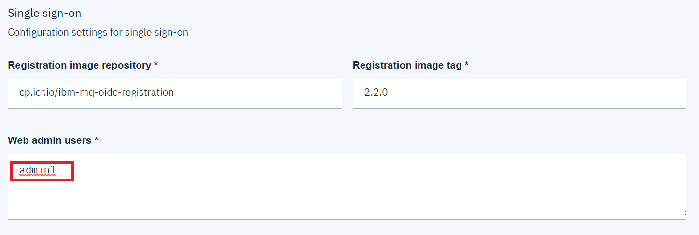

# Deploying a Non-Persistent IBM MQ Queue Manager on the Cloud Pak for Integration
These instructions will document the process to deploy a non-persistent IBM MQ on the Cloud Pak for Integration (CP4I) 2019.4.1. 

## Pre-requisites 
The Cloud Pak for Integration has been deployed and the access credentials are available. 

## Instructions
This section is separated into four parts:
### Log into the Cloud Pak for Integration Console
1. Open a web browser and navigate to the CP4I console:  
  
Commonly the first time you attempt to access the CP4I console a warning will appear regarding the certificate. This can be accepted as it is normally due to a self-signed certificate, or a unknow certificate authority. In a real production environment this would commonly be configured with a certificate that would be known by the browser, therefore please accept prior to demonstration to avoid confusion. 
1. Fill in the username / password and select *Log in*. The *Platform home* will be displayed:  

1. This page provides an overview of the capabilities of the Cloud Pak for Integration. We will focus on IBM MQ, so select the IBM MQ icon:  

1. You will be navigated to the IBM MQ section that highlights the capabilities. We want to deploy an IBM MQ instance so select *Create instance*:  

1. The *Create instance* tiles will be shown, select *MQ*:   

1. The launch page for the IBM MQ deployment will be displayed. This highlights any pre-requisites that should be completed prior to deploying. As we are deploying a simple Queue Manager we can skip these, click *Next*:  

1. A new tab will open for the MQ instance configuration, fill in the following fields:
    * *Helm release name*: mq-non-persistent
    * *Target namespace*: mq
    * *Target cluster*: local-cluster
    * *License*: Accept  
  
1. Expand *All parameters* and scroll down to the *Single sign-on* section. Once deployed the MQ Console will be accessed using the user credentials that you used to access the Integration Console. To assure this works the username used to login *MUST* be specified within the *Web admin users* section. In our case the user is *Admin1*:  
    
1. In the *TLS* section, select the *Generate Certificate* and enter any hostname in the *Cluster hostname* field (this is a required field but will not be used as we are generating a new certificate):  
    
1. In the *Persistence* section, deselect the *Enable persistence* check box:  
    
1. Start the installation by clicking the *Install* button at the bottom right. The install will be started, and you will be presented with:  

1. Click *Home*, this will navigate you back to Cloud Pak for Integration console, select the *View instances* tab 

