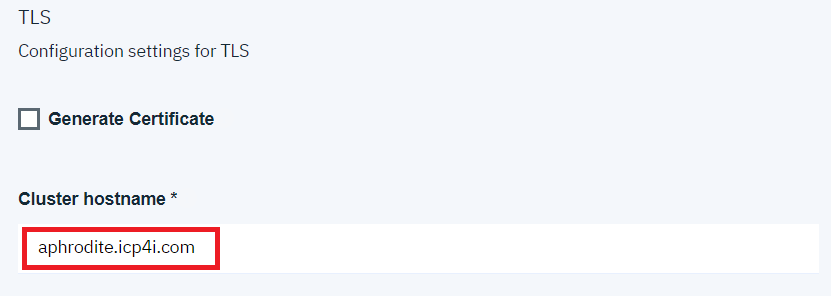

# Deploying a Non-Persistent IBM MQ Queue Manager on the Cloud Pak for Integration
These instructions will document the process to deploy a non-persistent IBM MQ on the Cloud Pak for Integration (CP4I) 2019.4.1. 
Health warning - any configuration of MQ completed will be lost when the container is restarted. This will mean that the [Basic configuration for messaging traffic](#basic-configuration-for-messaging-traffic) section needs to be repeated. 

## Pre-requisites 
The Cloud Pak for Integration has been deployed and the access credentials are available. 

## Instructions
This section is separated into four parts:
* [Deploy IBM MQ within Cloud Pak for Integration](#deploy-ibm-mq-within-cloud-pak-for-integration)
* [Basic configuration for messaging traffic](#basic-configuration-for-messaging-traffic)

### Deploy IBM MQ within Cloud Pak for Integration 
1. Open a web browser and navigate to the CP4I console:  
  
Commonly the first time you attempt to access the CP4I console a warning will appear regarding the certificate. This can be accepted as it is normally due to a self-signed certificate, or a unknow certificate authority. In a real production environment this would commonly be configured with a certificate that would be known by the browser, therefore please accept prior to demonstration to avoid confusion. 
1. Fill in the username / password and select *Log in*. The *Platform home* will be displayed:  

1. This page provides an overview of the capabilities of the Cloud Pak for Integration. We will focus on IBM MQ, so select the IBM MQ icon:  

1. You will be navigated to the IBM MQ section that highlights the capabilities. We want to deploy an IBM MQ instance so select *Create instance*:  

1. The *Create instance* tiles will be shown, select *MQ*:   

1. The launch page for the IBM MQ deployment will be displayed. This highlights any pre-requisites that should be completed prior to deploying. As we are deploying a simple Queue Manager we can skip these, click *Next*:  

1. A new tab will open for the MQ instance configuration, fill in the following fields:
    * *Helm release name*: mq-non-persistent
    * *Target namespace*: mq
    * *Target cluster*: local-cluster
    * *License*: Accept  
  
1. Expand *All parameters* and scroll down to the *Image* section. Change the *Image repository* value to: *image-registry.openshift-image-registry.svc:5000/mq/ibm-mqadvanced-server-integration*   
  
  For further information on why this customization is required please consult [Container Image Locations](#container-image-locations)
1. Scroll down to the *Single sign-on* section. Once deployed the MQ Console will be accessed using the user credentials that you used to access the Integration Console. To assure this works the username used to login *MUST* be specified within the *Web admin users* section. In our case the user is *Admin1*. The Single sign-on process runs a kubernetes job to configure the environment, this requires a container image. In our case this needs updating to *image-registry.openshift-image-registry.svc:5000/mq/ibm-mq-oidc-registration*:  
    
  For further information on why this customization is required please consult [Container Image Locations](#container-image-locations)
1. In the *TLS* section, select the *Generate Certificate* and enter any hostname in the *Cluster hostname* field (this is a required field but will not be used as we are generating a new certificate):  
    
1. In the *Persistence* section, deselect the *Enable persistence* check box:  
    
1. Start the installation by clicking the *Install* button at the bottom right. The install will be started, and you will be presented with:  

1. Click *Home*, this will navigate you back to Cloud Pak for Integration console, select the *View instances* tab 

### Basic configuration for insecure messaging traffic
An empty IBM MQ is setup within the Cloud Pak for Integration, and therefore MQ resources need to be configured to allow application to communicate. This section will document the steps required:
1. Return to the Cloud Pak for Integration Platform home and click on *View instance*:   
   
1. Listed will be the newly created IBM MQ instance, if it is NOT shown wait another minute and refresh the page. Click on the newly created instance.
1. This will open the IBM MQ Web Console. Commonly the first time you attempt to access the MQ console a warning will appear regarding the certificate. This can be accepted as it is normally due to a self-signed certificate, or a unknow certificate authority. In a real production environment this would commonly be configured with a certificate that would be known by the browser, therefore please accept prior to demonstration to avoid confusion. The default IBM MQ Web Console will be displayed:   
   
1. The first step is to add widgets to administration of the following objects:
    * Queues
    * Channels
  Click on the *Add widget* button at the top level and select *Queues*:  
  
  Repeat this for *Channels* so you see the following:  
  
1. As this will be an insecure setup of IBM MQ, security will be disabled. A seperat write-up will discuss how to provide a secure environment. Click the Queue Manager *mqnonpersistent* and select the *Properties* section:  
  
1. IBM MQ V7 introduced the concept of Channel Authentication which is enabled by default, this will be disabled. Select *Communication* and in the *CHLAUTH record* field change the value to *Disabled*. Click *Save* to persist the changes, and *Close* to dismiss the popup:
  
1. Default channels are created by IBM MQ when the Queue Manager is created. In general these should NOT be used, unless it is for demonstration. As such these have been hiden, to view these click on the cog associated with the *Channels* widget and select *Show* under *System objects*:    
  
1. Scroll down to the *SYSTEM.DEF.SVRCONN* entry, select the row and click *Properties*:  
  
1. Select the *MCA* section and type *mqm* within the *MCA user ID* field:  
  
  Click *Save* and *Close*
1.   

## Container Image Locations
