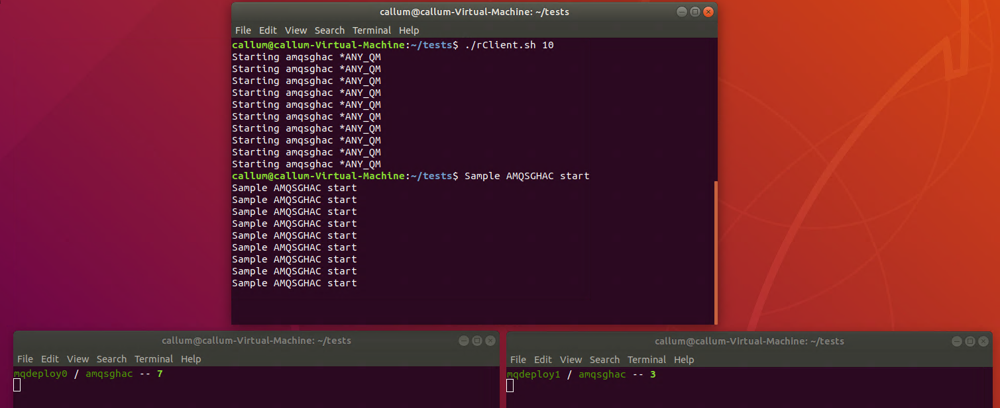
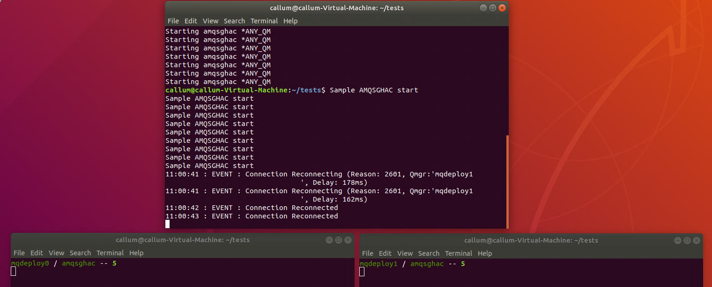

# Building an IBM MQ Uniform Cluster using IBM MQ Advanced 

This lab will demonstrate how you can deploy two IBM MQ instances and have connections balanced across the two. 
This currently requires a custom helm chart and the code has been uploaded to avoid typos.

## Pre-requisites
These instructions assume you have already installed:
* helm 
* kubectl
* oc (OpenShift command line tool)

## Downloading the helm charts
The IBM MQ Advanced helm charts are available [here](https://github.com/IBM/charts/blob/master/repo/entitled) and these instructions were created using [v5.0.0](https://github.com/IBM/charts/blob/master/repo/entitled/ibm-mqadvanced-server-integration-prod-5.0.0.tgz).     
For instance in my environment I completed the following commands:
```
wget https://github.com/IBM/charts/raw/master/repo/entitled/ibm-mqadvanced-server-prod-5.0.0.tgz
tar -zxvf ibm-mqadvanced-server-prod-5.0.0.tgz
```       
This will unpack the shipped 9.1.4 IBM MQ Advanced Helm chart into a directory called *ibm-mqadvanced-server-integration-prod*   

## Instructions
These instructions are separated into 4 parts:
* Updating the helm chart
* Deploying the environment
* Providing external access
* Verifying the uniform cluster works

### Updating the helm chart
There are four files that require updating, the updated version of these files have been included to avoid typo and a explanation of the changes included below. The original helm chart deployed a single StatefulSet with one or two PODs (to support different High Availability options). The changes below deploy a separate StatefulSet for each member of the uniform cluster:

#### [stateful-set.yaml](https://github.ibm.com/CALLUMJ/MQonCP4I/blob/master/resources/uniformCluster/stateful-set.yaml)
*Replacement Location:* ibm-mqadvanced-server-prod/templates/stateful-set.yaml
The new stateful set definition includes a loop, where a stateful set corresponds to a member of a uniform cluster. 
For instance if you have two members of a uniform cluster then two stateful sets will be deployed.

#### [service.yaml](https://github.ibm.com/CALLUMJ/MQonCP4I/blob/master/resources/uniformCluster/service.yaml)
*Replacement Location:* ibm-mqadvanced-server-prod/templates/service.yaml
Each of these stateful sets need a separate addressable endpoint for the uniform cluster. 
Therefore the new service includes a loop that generates a service for each of the stateful sets deployed.


#### [values-metadata.yaml](https://github.ibm.com/CALLUMJ/MQonCP4I/blob/master/resources/uniformCluster/values-metadata.yaml)
*Replacement Location:* ibm-mqadvanced-server-prod/values-metadata.yaml
To control if the uniform cluster capability is enabled a new *scaling* properties section has been added to the helm chart. This includes two sub-properties:

```
scaling:
  enabled: <true|false>
  replicas: <int corresponding to the number of uniform cluster members>
```

#### [values.yaml](https://github.ibm.com/CALLUMJ/MQonCP4I/blob/master/resources/uniformCluster/values.yaml)
*Replacement Location:* ibm-mqadvanced-server-prod/values.yaml
This corresponds to the default values for the new properties.

To apply this changes run the following commands to replace the files:
```
cd ibm-mqadvanced-server-prod
rm values.yaml values-metadata.yaml
```
Download the following https://github.ibm.com/CALLUMJ/MQonCP4I/raw/master/resources/uniformCluster/values.yaml
and https://github.ibm.com/CALLUMJ/MQonCP4I/raw/master/resources/uniformCluster/values-metadata.yaml to this directory.

```
cd templates
rm service.yaml stateful-set.yaml
```
Download the following https://github.ibm.com/CALLUMJ/MQonCP4I/raw/master/resources/uniformCluster/service.yaml and
 https://github.ibm.com/CALLUMJ/MQonCP4I/raw/master/resources/uniformCluster/stateful-set.yaml to this directory.

### Deploying the environment
1. Log into the OpenShift environment from the command line:     
   ``` oc login <API_ENDPOINT>```
1. Within my environment I decided to create a new namespace to avoid any issues. This is optional but you will need to customize the later steps if you do not complete.
   ```
   export mqNamespace=uniform-mq
   oc new-project $mqNamespace
   oc create -f https://raw.githubusercontent.com/IBM/cloud-pak/master/spec/security/scc/ibm-anyuid-scc.yaml
   oc adm policy add-scc-to-group ibm-anyuid-scc system:serviceaccounts:$mqNamespace
   ```
1. These instructions have been created to use the Entitled Registry for accessing the MQ Advance container. 
This requires a Kubernetes secret to be created. You will need an Entitlement key and this can be retreived from [here](https://myibm.ibm.com/products-services/containerlibrary). Use the following command:     
   ```
   export mqDockerPassword=<Entitlement Key>
   oc -n ${mqNamespace} create secret docker-registry ibm-entitlement-key \
         --docker-server=cp.icr.io \
         --docker-username=cp \
         --docker-password=${mqDockerPassword}
   ```
1. When MQ is deployed a certificate is required to secure the communication into MQ. This needs to be stored within a Kubernetes Secrte. Download https://github.ibm.com/CALLUMJ/MQonCP4I/raw/master/resources/uniformCluster/createCert.yaml and run:      
   ```oc create -f createCert.yaml```
1. The helm chart allows MQSC and INI files to specified for each of the stateful sets deployed. Within this example the location is predefined however this could be enhanced to be inputted by the user. Download https://github.ibm.com/CALLUMJ/MQonCP4I/raw/master/resources/uniformCluster/uniformCluster.yaml and run the following command:
```oc create -f uniformCluster.yaml```

1. We are ready to deploy our Uniform Cluster, run the following command from the directory where you unzipped the helm chart:       
   ```helm install mq-deploy --set scaling.enabled=true --set license=accept --set arch=amd64  --set image.pullSecret=ibm-entitlement-key --set persistence.enabled=false --set pki.keys[0].name=mykey,pki.keys[0].secret.secretName=mqcert,pki.keys[0].secret.items[0]=tls.key,pki.keys[0].secret.items[1]=tls.crt ibm-mqadvanced-server-prod```


### Providing external access
1. To provide remote access to the uniform cluster OpenShift Routes need to be configured for each of the MQ instances. To avoid typos I've created a YAML file that should work as is: Download https://github.ibm.com/CALLUMJ/MQonCP4I/raw/master/resources/uniformCluster/routes.yaml and run:      
   ```oc create -f routes.yaml```

### Verifying the uniform cluster works
1. To test the setup we will use a MQ sample called *amqsghac*. This will make a connection to a Queue Manager (which can be moved) and we will monitor the number of connections on each of the Queue Managers. All the material is stored [here](https://github.ibm.com/CALLUMJ/MQonCP4I/tree/master/resources/uniformCluster/tests), download the content of the directory to a machine that includes the MQ samples. On my system this was stored in */home/callum/tests*
1. There are a couple of environment related changes that are required:    
   * showConns.sh: 
      ```
      #!/bin/bash

      clear
      green='\033[0;32m'
      lgreen='\033[1;32m'
      nc='\033[0m'

      export MQCCDTURL='/home/callum/uniformCluster/tests/CCDT2.JSON'
      export MQSSLKEYR='/home/callum/uniformCluster/tests/key'
      ```
      The paths for MQCCDTURL and MQSSLKEYR need to be updated. In my case I am now using */home/callum/tests* so this changed to:
      ```
      #!/bin/bash

      clear
      green='\033[0;32m'
      lgreen='\033[1;32m'
      nc='\033[0m'

      export MQCCDTURL='/home/callum/tests/CCDT2.JSON'
      export MQSSLKEYR='/home/callum/tests/key'
      ```
   * rClient.sh:
      ```
      #!/bin/bash

      export MQCCDTURL='/home/callum/uniformCluster/tests/CCDT2.JSON'
      export MQSSLKEYR='/home/callum/uniformCluster/tests/key'
      ```
      The paths for MQCCDTURL and MQSSLKEYR need to be updated. In my case I am now using */home/callum/tests* so this changed to:
      ```
      #!/bin/bash

      export MQCCDTURL='/home/callum/tests/CCDT2.JSON'
      export MQSSLKEYR='/home/callum/tests/key'
      ```
   * CCDT2.JSON:
     This file reference the OpenShift Route hostname/IP address, currently it is defined as:
     ```"host": "9.11.221.16"```
     This needs to be customized for your environment, and four changes will be required.
 1. Now the changes have been completed, open three new terminal windows.
 1. In the first run ```./showConns.sh mqdeploy0``` if you receive the following error:
    ```./showConns.sh: line 19: runmqsc: command not found```   
    It means the MQ environment is not correctly set within the terminal and you need to run:     
    ```. /opt/mqm/bin/setmqenv``` 
    and resubmit the command. Initially you should see:
    ```mqdeploy0 / amqsghac -- 0```
1. Repeat the process in the second terminal but specify:
   ```./showConns.sh mqdeploy1```
1. In the final terminal window we will start the client applications that will connect to the Queue Managers, run:
   ```./rClient.sh 10 ```    
   To start 10 connections, initially you will see the system being unbalanced:      
     
   And then very quickly rebalanced:      
     
